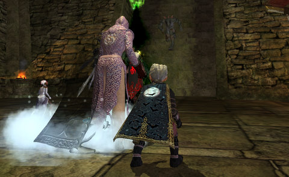

Back to: [West Karana](/posts/westkarana.md) > [2009](/posts/2009/westkarana.md) > [July](./westkarana.md)
# EQ2: Goodbye, Najena. Hello, Antonia Bayle.

*Posted by Tipa on 2009-07-15 00:15:29*

After naming their name/gender change potion "Norrathian Witness Protection Program", I was thinking SOE would have a cool name for the item that let you switch your server, but it's just called "Character Transfer Token". So boring. Why not "Commotion Potion for Interworld Motion" or something?

But they went with Character Transfer Token. And it costs 2,500 SOE Bucks, which is $25.00. Great deal, right? Except that you can't just buy 2,500 SOE Bucks. You can buy 2,000, or you can buy 5,000. So if you want to transfer one character, you're going to have to buy 5,000 for $50, transfer your character, and have $2,500 left over. I guess you could transfer another character. Or buy some house items or something.

Me, I transferred another character. Two, actually (so yes, I have 2,500 SOE Bucks in my wallet now).

I transferred the characters, looked for a group for awhile with my 80 Inquisitor -- for whom I felt I had to apologize in my LFG message for only being geared through Kunark and having nothing from TSO, which likely led to her not getting any invites.

I wasn't that surprised, and to be honest, I don't really care if she gets groups at this time. A gear reset is coming with the expansion, and that will be the time to catch up. For now, if she can help my troubadour main do some of the "solo" quests, I'll be happy. Partnering like that is how I managed to get through the Kunark quests and make it to 80 in the first place.

I browsed the web a bit and patched EQ2 on my other computer, and when that was done, I saw that a group needed a healer for the Temple of Cazic-Thule. Now, there's a place with a lot of memories. That's where I leveled Dina to 50, back when 50 was the level cap.

Got the group invite, tried to remember how to get to the Feerott, then tried to remember the path THROUGH the Feerott to the dungeon, eventually made it there, and there we were. They were dubious about having a defiler as a sole healer, but by the end of the evening, the only deaths were from people being idiots. You'd think people would want to let the tank get aggro before nuking, but... nope. I did what I could, but when me trying to keep jerks alive let the tank die, they had to be content with the occasional group heal.

It was a straight up dungeon crawl, and I had fun. None of the insane pressure of TSO dungeons. Didn't need my mythical or super amazing gear. Just a group of random players, having fun. 

I've always felt the real fun of any MMO isn't found at max level, where achievers constantly keep things on the edge, but lower down, where you aren't expected to be amazing, just good company.

Tomorrow, I start the long process of separating my stuff from guild stuff on Najena so I can bring Dina over. She'll be Tipa on Antonia Bayle, so I'll again have a character with the same name I use as an online handle :)

