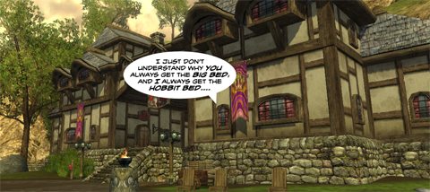

Back to: [West Karana](/posts/westkarana.md) > [2009](/posts/2009/westkarana.md) > [July](./westkarana.md)
# Daily Blogroll 7/16 -- Lost in Bree edition

*Posted by Tipa on 2009-07-16 07:40:18*

What makes The Prancing Pony such a "must see" when you're in Bree? Butterbur just stands in that same spot all day and all night, perpetually on the edge of remembering what it is he needed to do while buying sticks and pebbles from snickering children.

If you go, though, to the cloakroom on the second floor, you might find Melmoth of Killed in a Smiling Accident hiding from insanely super-powered wolves as he struggles with [Lord of the Rings Online's gated content](http://kiasa.org/2009/07/16/still-round-the-corner-there-may-wait-a-new-road-or-a-secret-gate/) -- where overpowered common animals with a long history of being dead block lower level adventurers from peeking around the next curve. (Wolfshead also has a tankard of tears, by the way, for [the poor, bereft children of J.R.R.](http://www.wolfsheadonline.com/?p=2619), whose money beds require additional stuffing).

Naamah of Aionic Thoughts heard that Aion's latest patch (1.5) would be adding a cool dozen new instances, and he had a sudden thought: Instancing is killing WoW. [Do we really want Aion to go down that same road](http://aionicthoughts.wordpress.com/2009/07/16/be-careful-what-you-wish-for/)?

Stropp [doesn't like people much](http://stroppsworld.com/2009/07/16/too-human/). At least, not human-type people. At least, not in MMOs. EQ2 has rats, cats, frogs and lizards, but most of them are evil, and all of them are just more or less re-skinned people. Why not more exotic races? (Well, Horizons did have [PC Dragons](http://www.istaria.com/races.php)).

Mixmeister and Diapermancer Thomas, the Friendly Necromancer, has done [another amazing remix of Wizard 101's music](http://thefriendlynecromancer.blogspot.com/2009/07/free-grizzleheim-remix-fo-yall.html), this time, the foresty, beastly themes of the Viking world of Grizzleheim. He once remixed a rather boring four-part Renaissance dance I recorded into something really special. He truly is a genius :)

There's a lot of things you can do in today's MMOs, but which one activity is the MOST fun? [For Keen, it's leveling](http://www.keenandgraev.com/?p=2706). I dunno. I tend to think of leveling as a chore, where I pay $15/month (or whatever) for the privilege of doing boring, repetitive tasks. I only enjoy leveling when I am having fun with the game, and levels come when they come, but there's no urgency to move on from where I am.

Petter finds [more danger in Nosepickers and Unannounced AFKers](http://blog.dontfearthemutant.com/?p=753) in Final Fantasy XI Online's Valkurm Dunes than he does with the more mundane Goblins and Star Bats. But aren't these mobs found in pickup groups in every MMO?

And finally, [via Wandering Goblin](http://www.wanderinggoblin.com/2009/07/15/pride-and-prejudice-and-sea-monsters/), Sense and Sensibility and Sea Monsters:

