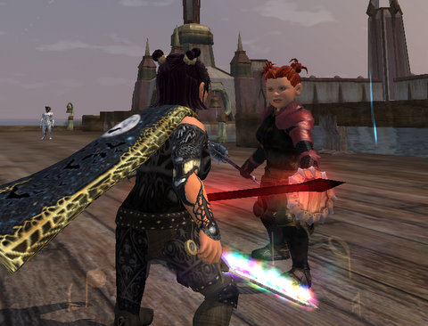

Back to: [West Karana](/posts/westkarana.md) > [2009](/posts/2009/westkarana.md) > [July](./westkarana.md)
# EQ2: Antonia Bayle, Day 2

*Posted by Tipa on 2009-07-16 23:33:03*

It's been a year since ~~Dina~~ Tipa and ~~Dera~~ Arda were able to be in the same place on the same server. I've got a HECK of a lot of "solo" quests to get done now, and now that I have a pet healer, they won't take forever because of downtime.

Today I moved Brightknife -- my character who does the fashion shows and the EQ2 one-panel comics -- and Dina, my main, to Antonia Bayle. Dina lost her home due to a bug that happens sometimes when you have to change your name in a move. The same bug hit Stargrace, and a GM dumped the entire contents of her home into her inventory. That's a nice thing for them to do, but my home had a Stargrace-built theater in it, and though she volunteered to build it again if she had to, I'd rather she didn't have to.

I'm soaking in the AB ambiance. For all its fans, the tone of the chat channels is identical to Befallen and Najena. There are lots of guild recruiting, and from their various spams, I build a picture of my perfect guild. Alt-loving, casual, occasionally raids t5-t7 content for fun and AAs, groups and does quests, maybe some TSO instances, or maybe just grouping at level 30 or 50 with an alt and just relaxing and having a fun time.

I need to start on the Moors solo quest line, and do that Order of the Rime quest, while keeping my ear open for guilds and talking to people. With any luck, by the end of the weekend I'll have found a home and can complete my next goal, leveling Tailoring to 80 and getting the tradeskill epic for Tipa. I'd also like to finish the quests that open up the shard-a-day dungeon; even if I never get a shard group, I can eventually get my T2 gear just by logging in each day.

It's good to have Dina and Dera back together again!

