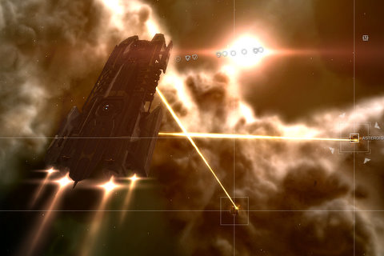

Back to: [West Karana](/posts/westkarana.md) > [2009](/posts/2009/westkarana.md) > [June](./westkarana.md)
# EVE Online: Retriever fun

*Posted by Tipa on 2009-06-05 06:24:20*

It took a really long time to get all the skills trained for this day -- it always seemed to be just one more skill I needed, and I think Mining V was the last I needed to fit the Modulated Strip Miner II asteroid crushers I'd bought a couple weeks ago in anticipation.

My target for my mining operation was 5m ISK/hour; if I could log in, spend a good hour mining, and come out 5m ISK richer, then I feel this side trip into mining on my way to my battle cruiser would be ultimately worth it.

Tracker Wolf's lessons in PvP came in handy as I headed out to mine. I found a system that contained a station where I could sell Veldspar for a decent amount, and jetted around the system a little looking for good places to place a safe spot. While warping between two nondescript, station-less planets, I dropped a bookmark in the middle of nowhere, tens of AUs from any warpable destination.

I warped back to it and just hung in space there. Nothing on the scanners. There was nothing of interest anywhere. This was a safe spot, and even if I had been in low security space, the effort required to find me would give me more than enough time to get to safety, even in the super-slow aligning mining barge.

This would be where I would drop my jetcan with my mining yields. If I wasn't right there with it, the can would be absolutely invisible to can flippers. I'd learned the folly of keeping a jetcan next to me while I mine. It's just an invitation to flippers.

I flew to the belts I'd checked earlier, released my mining drone, selected two Veldspar-rich asteroids and set to work. I was soon joined by a few others, two people in Incursus (Gallente mining frigates) and one in an Iteron Mark III (hauler), so it was clear they weren't there for trouble, but I called my mining drone back and sent out a combat drone just in case. Not that I thought I'd be attacked in 1.0 space, but just because I realize now that I don't know all the different ways people can use to destroy my ship, and having a drone out would maybe just be a sign to a potential griefer that I was not the easiest target in the sky.

Though with that Iteron out there, I really didn't need to worry. "Iteron" means "low hanging fruit" in the lowsec pirate lingo.

It took about ten minutes to fill my hold, about two minutes to warp to my jetcan dead drop, drop off a load and warp back (always to a different spot in the belt via bookmarks set while mining), and after about 40 minutes, ferried everything to the station I would be selling it and sold it. It was about 370K ISK per load in the end, and it's clear that even though the price was decent for Veldspar, it was a far cry from my 5M/hour target. And I might not be able to find a good decent price over 12 ISK/unit every time I want to mine; prices around 11 are far more common, so all told, I'll be making about half of what I wanted.

Moving on from here is possible; learning skills to reduce the taxes on selling my ore will help; being able to sell things region wide instead of just in the station I'm in would let me sell into stations in lowsec space which have better prices; learning skills to mine faster or with more efficiency could decrease the time I need to fill my hold. There's lots of things I can do, but I don't think I will ever hit my target; I might be able to squeeze 3M ISK/hour out of mining in my current region, eventually.

This is still faster money than Level I mission running, though.

