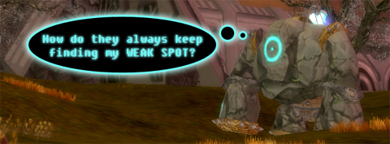

Back to: [West Karana](/posts/westkarana.md) > [2009](/posts/2009/westkarana.md) > [June](./westkarana.md)
# Nightly Blogroll -- Though Amaryllis dance edition

*Posted by Tipa on 2009-06-08 22:45:35*

The "Amaryllis" edition stuff? Well, here it is, a warm Spring night, just started writing, and "[Though Amaryllis dance in green](http://www.youtube.com/watch?v=NEOI5Ct9DL4)" comes up on the playlist, and it just seemed to fit the mood so well...

And re: the banner, well, Atlus' newly revamped MMO import NeoSteam closed its Open Beta today to relaunch soon as a real live game. Rumor has it that characters from both the closed and open betas will carry through to the live game, so if you've a yen to play a fairly standard fantasy grinder with PvP and a light industrial flair, give it a shot.

Aion had its first closed beta this last weekend, where players were invited to join the lighter side of Aion's warring factions. Aion has been passing out beta keys like they were Reese's Pieces at an ET convention and [though absolutely thoroughly detailed information about the beta is easy to come by](http://www.aionsource.com/forum/general-discussion/), only Ravious of Kill Ten Rats is [Daeva enough to blog about it](http://www.killtenrats.com/2009/06/08/aion-weekend-wrapup/). But then, he got permission (and I am trying to!). His take? Highly polished but standard gameplay, with the ease of the first ten levels no indication that there is no grind to come.

I find it hard to disagree with anything he wrote.

It's not so much that your game has standard classes, it's what the players want. It's what you do with them. Gordon at We Fly Spitfires (note: [I would love to fly in a Spitfire](http://www.warbirdexperiences.co.uk/fly_a_spitfire.html)) writes about [his favorite MMO classes from games past and present](http://blog.weflyspitfires.com/2009/06/08/mmo-classes-that-i-love/). Beastlord? Yes, please! 

Out of all the blog posts this weekend about people's experiences with Sims 3, [Ogrebears' is my favorite](http://ogrebear.com/?p=1031). You just KNOW that he's a rebel, in his leather jacket and emerald skin, [sitting at the school lunch table without a care](http://farm3.static.flickr.com/2474/3603078002_991e992b83.jpg?v=0) as the girls go crazy for him.

Lots of people agree that the biggest problem with playing MMOs is having to play them with other people. When you're solo, you can start and stop when you like and you always get first roll on all the loot. And you don't have to deal with other people's problems. Melmoth from Killed in a Smiling Accident asks, with [game](http://wiki.guildwars.com/wiki/Henchman) [after](http://biobreak.wordpress.com/2009/05/27/imaginary-playmates/) [game](../../../index.php/2008/10/22/eq-seeds-of-destruction-meet-caiffin-the-merc/) turning to NPCs to fill out your groups -- [will there be something you miss](http://kiasa.org/2009/06/08/we-even-picked-up-a-preacher-for-some-reason-and-a-bona-fide-companion/), after all, when all the other players disappear?

A month or so ago, Mythic called ex-Warhammer players back to the fold with an email detailing the exciting changes available for your exact character, name included. [Now they've sent out another letter](http://www.virginworlds.com/pg.php?n=10147) which mines your friends list so you can see which of your friends is still "carrying the banner".

Is it cool or creepy to get such personalized email? I can't wait to get an email saying, "Wow, bummer that you lost your job. Did you know that these day-time guilds are recruiting your class?"

WAR may be war everywhere, all the time, killing and more killing, but not all games promise that as their sole focus. EverQuest 2, for instance, has separate paths for adventurers and crafters, and crafters even have dungeon instances of their own (hint: you defeat the enemy by crafting). Ysharros and her hubby have been spending a lot of time [doing the harvesting and crafting quests and enjoying the uber rewards](http://stylishcorpse.wordpress.com/2009/06/08/of-shoes-and-ships-and-sealing-wax/). Who needs to kill dragons when you could be mining feysteel?

With over two million players, you never know who you'll find wandering around in Wizard 101. Thomas has an interview with Terry Dietz, a sculptor who is [slowly cataloging the wizards and fauna of the game in polymer clay](http://thefriendlynecromancer.blogspot.com/2009/06/interview-with-terry-dietz-aka-aedan.html). Absolutely amazing work!

Now that SOE is axing underperforming MMOs, which is next to go? Ardwulf has been tipping his toe in the pool where [Openedge1 usually swims](http://simple-n-complex.blogspot.com/2009/03/age-of-conan-retaining-players-good.html), and is [looking to see if XFire can answer which games are teetering on the edge](http://ardwulfslair.wordpress.com/2009/06/07/digging-into-xfire-numbers/). It's not looking good for Pirates of the Burning Sea and Planetside, but Vanguard might just sneak through.

Syp takes a look at how adding a simple travel power like Super Jump to a hero in City of Heroes adds an entirely new dimension to the game, and wonders why other games don't let you do truly heroic things like that? [Could super jump (and stuff like that) be the missing ingredient to making ordinary adventurers into heroes](http://biobreak.wordpress.com/2009/06/08/movement/)?

And lastly, Anjin has a complete run-down of [what we'll see in Free Realms' future](http://bulletpointsblog.blogspot.com/2009/06/news-filter-hints-at-future-of-free.html). Soccer/football? Yes, please! Prestige classes? Sounds EXCELLENT! Here's hoping SOE fixes my account so I can play again :)

See you tomorrow on the Tuesday Nightly Blogroll!

