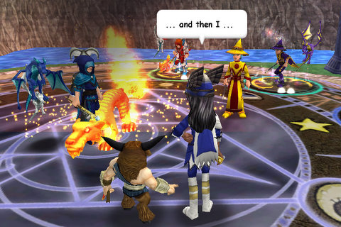

# Wizard 101 to let adults talk freely in game!

*Posted by Tipa on 2009-06-10 19:08:51*

One of the most frustrating things in Wizard 101 is the inability to speak freely. Wizard 101 uses a "dictionary" chat system, which only allows words in that dictionary, and things like numbers, names of states or anything else that might be used to easily identify or locate someone, replaced with an ellipsis (...).

This hardly slows down persistent players who quickly figure out ways around any and all chat limitations, but adults, at least, will no longer have to. KingsIsle is introducing "18+" chat to Wizard 101, which will allow paying subscribers of the appropriate age to say what they like -- aside from profanity, of course. 13-17 players will still see only the heavy filtering.

Here's the full info, from Professor Greyrose herself:

> We are releasing new community enhancements very soon!

One of the enhancements is 18+ Chat*. 18+ Chat will allow players a more open communication environment with other 18+ players. Starting tonight, we are adding web-based account controls for 18+ chat. Please be aware that although the control will be added to your account, 18+ Chat will NOT be launched tonight.

This chat feature is in response to our community's requests. To ensure the highest level of safety, we have chosen to launch this for our active Subscriber community only. Please note that this option is off by default, and you must actively select this option under Account Management.

Our terms for in-game communication with other players will remain the same. Violent and abusive behavior, as well as the exchange of personal information is still not acceptable.

Once we launch this feature, the following updates to chat will apply:

Menu Chat (default setting for under13)
• players will continue to see only Menu Chat.

13 to 18+ Text Chat (default setting for 13+)
• players will continue to see only our Dictionary Text Chat.
• players will NOT see the 18+ chat.

New 18+ Chat
• will be filtered for profanity.

*Accounts must be 18+ and must be an active subscriber with a valid credit card on file.

I can't wait to see what else they're working on!

