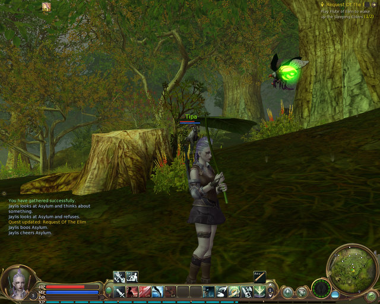

# Aion: The User Interface

*Posted by Tipa on 2009-06-16 23:15:23*

Hudson wanted a look at the Aion UI -- and that's fair. 

I found out that Aion was built on the Crytek engine, and that implies it won't "run on a toaster", the famous boast Blizzard made about WoW. 

Just before I took this screen shot, it started raining in game. My character looked with disgust at the sky, and since it looked like I wasn't going to be running her anywhere right then, pulled out a broad leaf to shield her head from the rain and sulked. The game is full of cute little animations like that. Your character has a life when you're not at the keyboard, and will always be reacting to the environment in some way if you haven't got anything else going on. Above her head are her health and power bars. Resting works wonders, but there are potions et al to get you back into the fight. Standard stuff.

At upper left is my buff bar; I have on buff going, but I have a couple short term buffs not shown there. At upper right is the quest log. The quest log is tied into the map similar to LotRO's quest helper. I think you can turn that off, but who does, right?

Not shown (because I'm not in battle) are the combat indicators in the middle of the screen that alert you to combo and reaction opportunities (right out of DAoC and Vanguard), so you can keep your eye on the battle instead of watching the button bar -- a nice feature and it comes in very handy.

Middle left is the chat window, which is standard -- gets out of the way when you don't want it. I don't know if you can read that, but it shows the results of a recent harvest and some people testing out emotes.

Harvesting gives adventure experience, by the way. It would take forever, but you could level to your Ascension without killing a thing. After you Ascend, though, if you come back to mortal lands, you can't harvest these lesser items -- as you no longer have any use for human items.

Across the bottom is the button bar. Portrait on the left (not really seeing the need for this aside from "because WoW has one"). Just to the right are three bars for health, power and "Divine Power". Once you Ascend, killing stuff builds up DP that you can spend on various powerful abilities. You lose all your DP when you die. You also lose experience, which you must buy back. I don't know if you can delevel through dying, but I doubt it.

Next to that, along the bottom, are the hot keys. These will be different if you're not a Scout, but I imagine not too different. Start Combat is the first one, next is Backstab, after that is Counter, which does a devastating hit after a block (and starts a combo later on). Next past that is a special buff that automatically blocks the next attack -- use this when you see a monster charge a special attack. Their attack does nothing, you follow up with a Counter and then a combo... flip 'em over, they're done. Past that is a buff which improves some ability for awhile.

The second to last dial is the flight indicator that shows how much flying time you have left, and lastly, the minimap on the far bottom right.

And I know I could have saved myself the time taken to type this up because it's nothing not seen before. Aion takes all the other MMOs you play, fits them together in a new way and gives back something new.

It doesn't go so far as to replace the other games -- EverQuest II, in particular, has far more social gameplay -- but what it does, it does perfectly.

