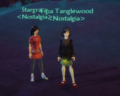

Back to: [West Karana](/posts/westkarana.md) > [2009](/posts/2009/westkarana.md) > [June](./westkarana.md)
# Daily Blogroll 6/23 -- This and That edition

*Posted by Tipa on 2009-06-23 07:55:46*

Between allergies and traveling, hasn't been a lot of writing being done. When I got back home Sunday, there were nearly 200 messages in the my feed readers. Ugh. Lots happened!

<-- You'll see over on the left that we now have a guild on Free Realms. Let me know if you want to join ;)

On to the blogs!

As an aside on his "[W101 Player Trading Cards](http://thefriendlynecromancer.blogspot.com/2009/06/player-trading-card-of-day-devin.html)" theme, Thomas the Friendly Necromancer notes that many Wizard 101 bosses [are now virtually unkillable](http://www.wizard101central.com/forums/showthread.php?t=15468). Supposedly, the bosses now have a specific strategy. With a definite script to many boss fights, is Wizard 101 taking a step toward the extremely scripted encounters of World of Warcraft.

Beau Turkey spend 1279 words (yes, I counted, took me all night) telling us that ["sandbox" is a stupid word](http://epicdolls.com/beauturkey/?p=1667) for a game that offers choices in gameplay. Next on his docket: explaining why it's "ketchup" and not "catsup", dammit.

People often use the term "WoW Tourist" to disparage those who leave WoW from time to time to try other games, but eventually return to the fold. Spinks becomes the first person I know of to extol [the virtues of being a dyed in the wool WoW tourist](http://spinksville.wordpress.com/2009/06/23/the-tourist-trap/). Can't argue with people who stay with a game. I was an EQ tourist once. Once.

Naamah at Aionic Thoughts has collected [all the chain attack animations for all eight of Aion's classes](http://aionicthoughts.wordpress.com/2009/06/22/and-beta-weekend-2-ends/). They are pretty darn impressive. You just know that PvP using these chains is just going to be about the most fantastic thing to watch -- EVER.

Snazfg has the news about Aion's PvP, as he spent a few hours this last play weekend seeing how the wings work when life is on the line. It turns out that [adding that crucial third dimension to PvP](http://snafzg.mmofansites.com/posts/1399-my-initial-impressions-of-aion) changes everything. And gives the reason why your character will always face its target.

And lastly but not leastly, Hudson wants you to know what happens when you're just content to play your game and not worry about all the changes and what they might be doing to your game. [You're KILLING YOUR GAME](http://hudshideout.com/blog/?p=2716). So, you know, keep reading those blogs.

Well geez, you guys blogged so much on the weekend, you didn't have anything left for Monday? ;)

See you soon and keep on gaming!

