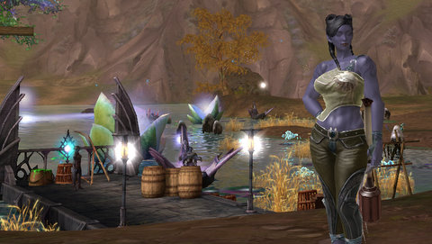

# Daily Blogroll 6/24 -- I Love Allergies edition

*Posted by Tipa on 2009-06-24 08:19:54*

Yes, we're back to the Daily Blogroll. Another allergy attack has left me asleep by 9PM, which really shortens the nights for me.

Is Aion too derivative to be successful? [Tobold thinks so](http://tobolds.blogspot.com/2009/06/clone-wars.html). In fact he wonders why people would pay full price (US$15/month) for a WoW-like like Aion when they can get the real thing for the same price, or a free WoW-like in Runes of Magic. He also doesn't hold out much hope for Fallen Earth, calling it too much like failed MMO Tabula Rasa "just working less well, being less fun, and having less good graphics". So that's that.

Being a WoW-like doesn't look like it will keep many away from Aion. Spinks thinks [the beauty of the game, the storytelling and the PvP](http://spinksville.wordpress.com/2009/06/24/how-things-are-shaping-up-for-aion/) (as well as the third dimension with flight) will bring people in. Caliga of MMO Gamers has the rundown of [the extra stuff you can expect in the collector's edition](http://mmogamers.freeblogit.com/2009/06/23/in-on-aion/), as well as an automatic pass into the beta.

Speaking of new games, Hudson has the latest round-up of the news Cryptic has been leaking about [the state of Champions Online](http://hudshideout.com/blog/?p=2771), due to be released September, same as Aion. 

Having played both betas, I would go with Aion if forced to choose, but the Champions NDA prevents me from saying just why.

Syncaine at Hardcore Casual looks at Blizzard's limiting of the formerly-open Wintergrasp PvP zone to 100v100 [with some measure of skepticism](http://syncaine.wordpress.com/2009/06/23/blizzard-on-wg-we-did-not-want-that-pvp-anyway/) based on other games (like Warhammer, Dark Age of Camelot, EVE Online, Darkfall and others) being able to handle much larger fights. Tobold [uses some bad math](http://tobolds.blogspot.com/2009/06/wintergrasp-becomes-battleground.html) to make the case for it being a strain on resources to keep it unlimited. (In a client-server architecture, resource use increase linearly, not geometrically).

Blizzard is using WoW as a money machine to support development on other upcoming titles. As long as the WoW ATM keeps spitting out million dollar bills, everything is FINE and it's easier to limit players than add more resources.

The best thing about WoW, if you're Blizzard, is that you can't beat players away with a STICK, [as ~~Zubon~~ Ethic found when he tried to sign back up](http://www.killtenrats.com/2009/06/23/the-rough-road-back-to-wow/). No matter how many roadblocks Blizzard threw in his way, no matter how much it cost him to do it, he was gonna play WoW again, dammit.

Lastly, if you're not a fan of Hayao Miyazaki's movies, I can only guess you've never seen any of them. To even start with why I love them would take a thousand words, so I won't say more than: The very first anime I ever saw was Miyazaki's "Nausicaa of the Valley of Wind". A friend sat me down and made me watch it, and he had a weird smile on his face. It was in Japanese, I didn't understand a word of it, nor what was going on, but even just with the pictures and Jo Hisaishi's amazing music to go on, I was blown away. When I later saw it dubbed in English, I was blown away yet again because the plot was just as amazing as the visuals.

For the past decade or so, Miyazaki's Studio Ghibli has had a deal with Disney where they would bring Miyazaki's films to the US dubbed in English by major voice talents, uncut and unrearranged, exactly as how they were released in Japan, except in English. Since then, Princess Mononoke, Spirited Away and Howl's Moving Castle have had astonishingly wonderful US theatrical releases, and this summer comes his latest masterpiece, [Ponyo, about a goldfish who makes a wish to be human](http://io9.com/5301790/english+language-trailer-for-hayao-miyazakis-ponyo-surfaces) -- with disastrous consequences.

See it, you'll love it.

