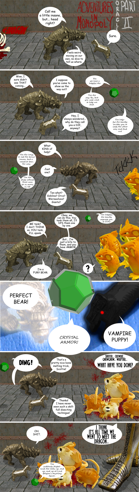

# Adventures in Monopoly: Oracle, Part II

*Posted by Tipa on 2009-03-09 00:28:18*

Last week, a magical Scrabble board intervened in a fight between Bear and Scottie before the wielding of the mystic forces each command could tear the Monopoly board entirely apart. Seeing they would not listen to reason, as a last resort, the Scrabble oracle sent the two pieces through a dimensional rift, where they would learn to work together -- or perish.

---

Since this (and part of the next) comic take place in a computer-generated dungeon, I figured this would be a good opportunity to practice lighting and set design. When I'm photographing on the Monopoly board, I try for weird angles just because I have that freedom. Here, it's one lighting model, one set, and everything had to be acted out by the pieces.

I had to model the 12-sided die, the dodecahedron. This was REALLY not as easy as I thought it would be. After trying for a couple of hours to figure out the math for the twelve FACES (as opposed to the vertices or edges), I just went to the web and found a mesh. I was out of time by that point, so wasn't able to put numbers on the faces.

The last actor had to be the monster they'd fight. I went to my box of toys and found a Rattata back from when the kids were into Pokemon. PERFECT! Plus -- killing rats, right?

My sister gave me a huge statue of a knight for Christmas. I looked at this on Christmas Day and wondered just what in heck I was going to do with a foot high pewter KNIGHT?

Oh. Hello, Lord Belgian!

The last thing I wanted to work on was the balloons and lettering. They are usually pretty awful, so this time I wanted to do them as if I cared, WHICH I DO, so that's a good reason to make it LOOK like I do.

I (accidentally) discovered that you can fit text to a shape, something probably I should have found out when I started all this. So, from now on, you'll get decent looking text balloons.

Unless I get ambitious and do Oracle Part III during the week, I'll be a week late for it, since I will be away Sunday through Wednesday next week.

