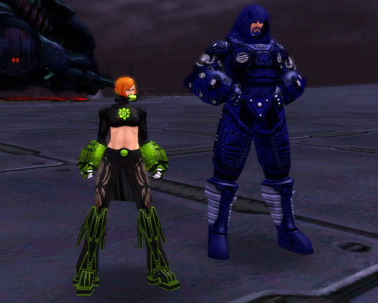

# City of Heroes: Adversarious and Radium Red

*Posted by Tipa on 2009-03-11 07:07:43*

There's maybe two MMOs that I have played where the newbie grounds are always full of people. One is World of Warcraft -- when I played, there were always people around the newbie grounds. The other is City of Heroes.

It's going to be getting a lot busier, what with Issue 14 bringing along the Architect system, where people can make their own adversaries and mission arcs and then publish them for everyone to play. The spotlight of buzz will once again focus on this always innovative game.

Last night, after our TOTALLY SUCCESSFUL raids of Shard of Hate and Tomb of the Mad Crusader in EQ2 with the Ascarey raid group, Kasul and I headed into City of Villains for a little fun. Kasul has never played before, so instead of being awesome with my mid-level mastermind, I started over as well with Radium Red, a Tech Dark/Rad Corruptor, a build I'd never played before. Kasul rolled up Adversarious, a Brute. We made a leveling pact and headed into battle to deliver the Rogue Isles from the hands of the Snakes and the Infected into, well, OUR hands.

How many years since City of Heroes launched? And STILL, no game has matched the complexity of their character creator. Chronicles of Spellborn comes closest, of the games I've played, but even that game has only a fraction of the possibilities. Before you even get to work on your costume, you've already had to choose your origin, primary and secondary power sets -- choices which can never be changed and affect everything you do forever.

Kasul realized that he would probably end up rerolling as he learned his way around. Everyone does. CoH is NOT an easy game to pick up.

I spent some time browsing the CoH forums for information on Corrupter builds, which seemed to have two major themes. The first -- if you do things right, you will never get hit. And the second -- only babies need healing. If you play right, nobody on your team will need your healing powers.

With such awesome advice, I picked some long range dark blasts and spent the night picking off mobs from extreme range. After Adversarious died, I started tossing the occasional heal because we are apparently Insufficiently Awesome, which would be a great supergroup name.

There's a lot to like in City of Heroes, but I didn't mention to Kasul last night that the missions we did were -- well, pretty much what you do. The enemies get tougher and you get better powers, and there are the mayhem missions (which are a lot of fun), the mission arcs, strike teams/task forces, but, just as everything you do in Wizard 101 centers around playing a card game, everything you do in CoH centers around jumping into an instance and killing everything you find.

This is precisely why I've never been able to get out of my 20s in CoH. And why I'll be checking out Champions Online in June -- the promise of getting out of the warehouse is just too tempting.

But between now and then, there's Paragon City and the Rogue Isles to explore, and missions to architect, and time to enjoy all the many things that CoH just does *right*.

