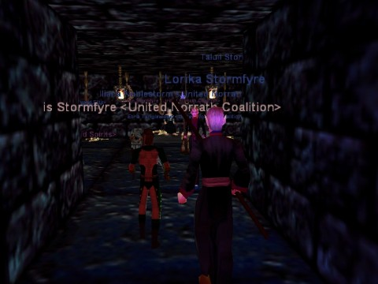

Back to: [West Karana](/posts/westkarana.md) > [2009](/posts/2009/westkarana.md) > [March](./westkarana.md)
# Classic EQ Petition

*Posted by Tipa on 2009-03-12 07:17:20*

It's probably just because EverQuest was my first really huge MMO (though not my first; Nexus: Kingdom of the Wind was my first), but I've never really felt about any other MMO the way I felt about EQ. Even though sometimes it was frustrating, it was always fun, and it's the friends I met there and the memories I have that have kept me subscribed since May of 1999.

SOE announced in January that they would be combining the Druzzil Ro server with the Combine server. The Combine server was the last remaining progression server, a server that gradually opened up content based on players reaching certain milestones until the servers unlocked everything. 

They also announced that they would be [adding a NEW server in March](../../../index.php/2008/12/19/everquest-merging-servers-adding-new-server-in-2009/), this month, for the EverQuest 10th anniversary, and that they would have a poll open in January to decide upon the rule set for this new server.

As far as I know, they never had this poll (or if so, I never saw it). But I haven't heard anything about this new server since the announcement last year. So there still might be time to influence the new server.

Those of us who remember the old, hard days of EverQuest, where your reputation was everything, friends were essential and the community was strong, know that no modern game -- not even modern EverQuest -- would consider making a game with an element of real fear and danger. The "[Classic EQ Petition](http://www.classiceqpetition.com/)" page says different -- that yes, actually, there are those of us who still would like to play EQ as it was originally, very, very dangerous, but where, with friends, you could leave the cities and strike out into a world of true adventure.

If you think that's something you'd like, too, why not [sign the petition](http://www.classiceqpetition.com/petition.php)? 
