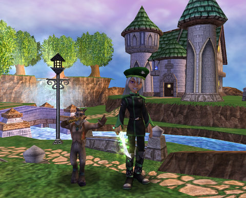

# Wizard 101: Housing goes LIVE Wednesday!

*Posted by Tipa on 2009-05-05 21:40:07*

We've word from Ravenwood that the newly-named Builder Turtles are being dropped off at their new homes across the Spiral, and that tomorrow, we'll be able to buy and furnish our own homes. Thomes the Friendly Necromancer has been [finding lots of treasures everywhere](http://thefriendlynecromancer.blogspot.com/search/label/House%20Item%20of%20the%20Day), and I've gotten a good look at [all ten of the currently available homes](../../../index.php/2009/04/26/wizard-101-all-ten-player-houses/) ([and a closer look at a couple](../../../index.php/2009/04/23/wizard-101-player-housing-on-test/)).

Check out the complete information on player housing in [the May newsletter](https://www.wizard101.com/site/home2/wizard101/page_8ad6a4042100700b01211200afe1031f).

> Wizard101 will be offline Wednesday May 06 2009 starting at 3:00am Central US time until approximately 8:00am Central US time.
Wizard101 will be offline for an extended period of time tonight so we can implement the much anticipated Castles & Lands housing feature, voiceovers for Marleybone, MooShu and Dragonspyre, and many other exciting updates.

