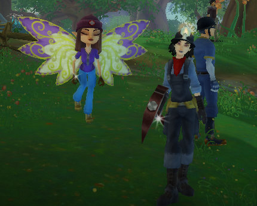

Back to: [West Karana](/posts/westkarana.md) > [2009](/posts/2009/westkarana.md) > [May](./westkarana.md)
# Free Realms: First Impressions

*Posted by Tipa on 2009-05-12 07:16:23*

  
Etha, 8 Medic; and Tipa, 16 Miner

Tipa is: 16 Miner/12 Ninja/8 Chef/7 Archer/2 Wizard

I've been enjoying myself quite a lot with Free Realms the past couple of weeks; when I sit down to play an MMO, like as not these days it'll be FR I fire up. I've been two boxing, which isn't really needed nor entirely effective, but makes some things easier. The dungeons are usually fairly challenging for their level, there's humor everywhere, there's a sort of whimsy I like, and I can't finish a quest without picking up a few more.

For me, it's a great solo game, with a lot of the stuff I like, like dressing up in cool outfits and having huge monster glowy weapons.

But it isn't a social experience. I've given up entirely trying to add my friends to my friends list, so aside from a couple I've been lucky enough to add, all the many, many people I would like to adventure with might be in the world, but I'll never see them or know they are there. Even if I did, friends are usually in mini-games and are out of contact.

This is the thing. Minigames that take you out of the world, break the MMO paradigm. The other players you see are usually just in the world enough to get to the next minigame or combat instance.

Respected gamers have noted that the game doesn't have [a single path](http://tobolds.blogspot.com/2009/05/free-realms-combat.html) to max level [through quests alone](http://commonsensegamer.com/?p=1318). While this differs from World of Warcraft (and Wizard 101, for that matter), I actually enjoy this aspect of the game. I'm not on rails! I have the freedom to level how I like because in Free Realms, the experience for killing a monster is enough to level on all by itself. Quests actually don't give that much experience.

You could possibly just skip your class quests entirely, as I did when I started a medic on my other account to help out my combat jobs which couldn't take hits very well. She spent her first few levels spamming her heal as my main character took down the dungeon goals, but now she's mixing it up in the melee as well (and is the tank when I am leveling ranged combat jobs like archer and wizard). Point is, that it was only last night that I got around to working through her medic quest chain, and doing them all up until the "come back when you are level 10" quest only gained her one level, from seven to eight.

The dungeon design in Free Realms is fantastic, they are utter joys. I've been in perhaps a dozen of the longer dungeons, and they've all been entirely different and fun enough to go through several times. Which you'll want to, as most of your better gear comes from running dungeons.

My biggest issue with Free Realms is that I am playing alone. Since it's nearly impossible to find people to adventure with, and players spend most of their time out of the world entirely, in their own private minigame areas, it's a very lonely experience. Contrast this with Wizard 101, where if you stand still long enough, you're surrounded by friends coming by to see what you're up to.

But Wizard 101 is a social MMO. Free Realms is an exploration MMO. I love exploration and I am a big fan of checking out Free Realms' more distant corners. There's still big huge parts of the game world I haven't been to, and most every place I've gone leaves me wanting to return and explore more of it. Neither games are achiever MMOs, which leave gamers used to WoW's endless grind to become more uber unsure how to play either of them.

If Free Realms doesn't figure out how to have a more social experience pretty quick, I question how many kids it will attract. I play a fair number of F2P MMOs. One thing kids love is MMOs they don't have to pay for, or that they can buy a card at Target that gives them playtime or in-game currency. Aeria, Outspark, Acclaim, Nexon, et al -- these are publishers of MMOs that are absolutely CROWDED with kids. You'll find all the successful games have one thing in common. It's EASY to meet up with friends. Kids don't seem to mind grindy games as much as adults apparently do. They don't need quests to tell them what to do. They just want to be doing whatever they are doing with friends. The MMOs they play usually have well-defined areas where players can meet and group up.

If Free Realms can figure out how to bring some social gaming to their already amazing exploration game, they might have a hit. Otherwise, it's hard to see how they will keep the kids when there are so many other social games out there for them, and the adults will likely just go back to playing more traditional MMOs.

