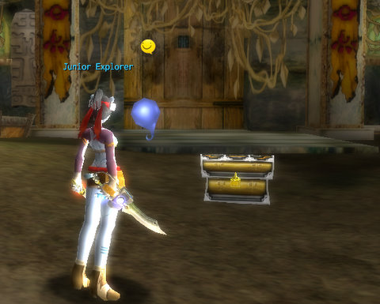

# Atlus' NeoSteam: First Impressions

*Posted by Tipa on 2009-05-22 06:44:26*

See, this is exactly why you can't do "first impressions" on an MMO. What does my couple hours of time in Atlus' newly relaunched MMO NeoSteam tell me about the rest of the game? Not a lot.

On the face of it, it's nothing more than a reskinned fantasy MMO with an anime style similar to Dream of Mirror Online and other games of that ilk (though without, thus far, DOMO's strong story). You have two nations at war, one with a technology bent and the other magical, though at first glance, this doesn't lead to much difference in game. Six races (four human or human-like, two monster), four professions, and not much avatar customization.

I made a Lyrell twinblade. Um, scout. Lyrell are humans with cute animal ears and a special connection with nature. Scouts are your melee dps class. And though the twin blades have hoses and bright puffs of steam coming from them, they are blades nonetheless, and nothing about the names of the weapons (dirks, swords, sabers, broadswords, bows, etc) hint at any sort of Steampunk connection.

I don't want to harp on this too much, but in my first nine levels, the only signs of a Steampunk nature to the game were the huffing and puffing engines at which you do crafting -- exactly the same as a forge in any other fantasy MMO.

You start off with one weak combat art, which you train up by spending the skill points you get when you level, and training points you earn by using your skill. A Level 3 sword attack, for instance, might require one SP and 1600 TP -- OR you could choose to learn a small radius AE attack instead.

The newbie fields are full of hopping little doughy critters called piyos and puyos (hey, I LOVED [Puyo Puyo](http://en.wikipedia.org/wiki/Puyo_Pop)! Now THERE was a game! Why can't Free Realms or some other minigame portal copy THAT! With the characters and everything!). Anyway, these exact same critters are in Dream of Mirror Online, and you do the same thing here you did with those -- whack them until they die. Also similar to DOMO, killing enough of the critters summons larger versions who are after revenge and their own certain dooms.

Leveling is fairly quick and painless, you get a combination pet/minder who advises you about leveling, skill training and so on as you wander.

But that's not the POINT, none of this is, and this is why first impressions, including this one, are worthless.

From the in-game broadcasts, it was clear that the real game lived at the higher levels. Our side (the "good guys") would attack the other side (the "other good guys"), or they would attack us in what seemed like a constantly shifting battlefield. Or special high level dungeons would suddenly open, perhaps based on the realm battle.

And these broadcasts about the goings-on in the wider world made me want to whack another puyo, get to 11, choose a subclass (at 10), craft myself some armor, and head out looking for trouble.

The point of the game is not and never has been about adventuring in the Steampunk milieu -- that will still have to wait on Gatheryn's eventual release. It's a re-skinned fantasy MMO with lots of levels that go fairly fast and an RMT store you'll recognize from any Asian F2P game. The point is to meet on the battlefield and gain access (I believe) to high end dungeons, and if you ever read something that pretends to be a full review of this game without delving deeper into these aspects than I have, well, you'll know what it's worth.

