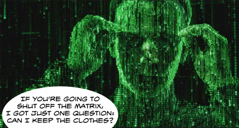

Back to: [West Karana](/posts/westkarana.md) > [2009](/posts/2009/westkarana.md) > [May](./westkarana.md)
# The Matrix Online: Unplugged

*Posted by Tipa on 2009-05-29 05:41:42*

SOE has long said about its games that no matter how many or few players a MMO had, as long as it made money, they'd keep the lights on.

Seems that day has come for The Matrix Online, which will be [sending red pills back into the real world July 31](http://forums.station.sony.com/mxo/posts/list.m?topic_id=36300028715), but they won't go quietly. Major events in the virtual universe will be revisited, leading up to a world-ending event, so if you have a MxO account gathering dust, now might be the time to plug back in and have one last romp through the city.

MxO was one of the first MMOs to try and model hand-to-hand martial arts in any realistic way (kung fu MMOs like [Twelve Sky](http://12-sky.aeriagames.com/) seem to make it entirely too magical). The game was built on a three-way faction war between the Machines, the Exiles (rogue programs) and the Free People of Zion, and was just chock full of innovation. Unfortunately, the game came out as interest in the movies waned, and it never got the chance to stand on its own, apart from the IP.

The devs will move on to other projects within SOE.

(Thanks, [Warcry!](http://www.warcry.com/news/view/92021-Matrix-Online-To-Shut-Down-End-of-July))

