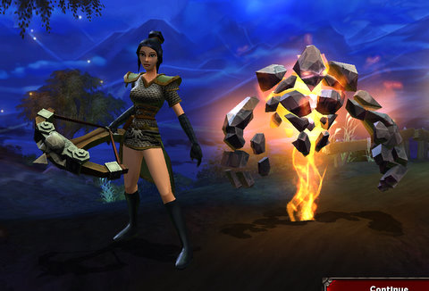
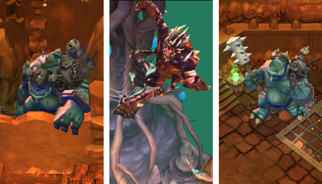
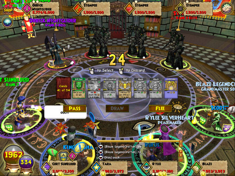
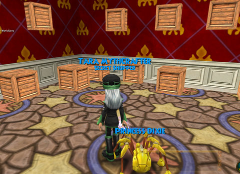

Back to: [West Karana](/posts/westkarana.md) > [2009](/posts/2009/westkarana.md) > [November](./westkarana.md)
# Weekend Gaming: Torchlight and Wizard101

*Posted by Tipa on 2009-11-02 08:08:01*

The weekend wasn't ALL EVE Online, though it could have been. That game is just SO addictive, though, that I have to consciously NOT log in, find something else to do.

Thankfully, I had Torchlight backing me up.

My Torchlight Vanquisher is about 4/5 of the way through the main storyline, and I'm already thinking about her retirement. In Torchlight, once you've finished the main storyline, you can continue on with custom maps or user mods, or retire the character. Retired characters can pass along one special item to their heir, and this item will become simultaneously more powerful and lower level. You can keep doing this until you eventually make the most powerful item in the game that can be wielded by a very low level character. My plan now is to retire the Vanquisher Marksman and start a Vanquisher Rogue -- a two-bladed dervish of spinning steel, and then use that character to run user mods.

A long time friend from my EQ days (hi, Flemick!) was looking for people to run Bristlebreeze with in Wizard101. That's the new level 50 tower that came with the last expansion, and the bosses were free with all the tricks that bugged people when the once-safe bosses on the main storyline tried them -- bosses that took extra turns, used super-powerful attacks, that basically cheated. The outcry forced the devs to take them out of the storyline, and hide them away in Bristlebreeze.

I'd mostly soloed my way up the tower with henchmen helping in the test realm, but hadn't yet been in the live game, so I was pretty pumped to see it finally, and to get past the first boss who was bugged in beta.

Flem/Trevor got disconnected the first AND second times we tried the tower. The second time, we elected to fill his spot with a henchman and we ALMOST finished the tower. None of us was familiar with the last fight, though, and we Did It Wrong.

We almost won, but we managed to tear defeat from the jaws of victory and had to come back later. Some hours later, Thomas the Friendly Necromancer was online, so Thomas, Trevor, I and Thomas' son's character went back for another try. And this time it was easy. Is there ANY problem extreme DPS cannot solve?

It made up for my disappointment over Halloween. I'd decorated my home in the style of a 90s adventure game, but nobody came :/

