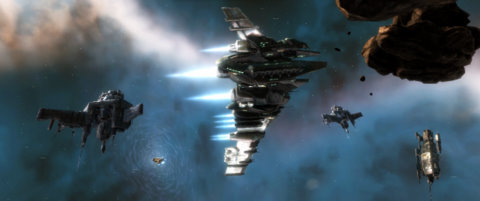

Back to: [West Karana](/posts/westkarana.md) > [2009](/posts/2009/westkarana.md) > [October](./westkarana.md)
# EVE Online: Not dead yet

*Posted by Tipa on 2009-10-22 07:40:49*

Wow, it's been a week since I posted? Really?

It's been a REALLY BUSY week, though. And having to leave really early in the morning for the bus and come back really late because of the bus isn't helping -- but I DO get to read every morning and night. I'm reading Mark Twain's "Innocents Abroad", his journey through Europe, Asia and the Holy Land while in exile. I'm really mining that Google Book partnership with Sony's eBook reader.

And, well, EVE has been grabbing more and more time. I have a good corp, friends with another corp that lets us tag along on some of their nullsec ops, just started into the business side of things which means a lot of time with the market interface and OpenOffice spreadsheet, and also dragging a hauler from star system to star system picking up my buy orders.

Oh yeah, speaking of nullsec ops, last night was Ratting in Providence.

You know, going from belt to belt, killing NPC battleships, collecting salvage and bounties and moving on. Safe, happy fun, right?

So then we warp into a corp on a ice mining op, we move on. Unfortunately, Mister Xxxxxx Xxxxxxxxx was stuck having to wash out his underwear when we warped in, and he had some words about it.

Xxxxxx Xxxxxxxxx > you neutrals are in violation of provadence rules concerning neutral operation in our space
Xxxxxx Xxxxxxxxx > withdraw immedatly
Xxxxxx Xxxxxxxxx > or we will consider this a hostile act
sredans > how so
Cassric > Who Xxxxxx?
sredans > didn't target none of you
Xxxxxx Xxxxxxxxx > your jeprodising our poperations
Xxxxxx Xxxxxxxxx > this is your last warning
Tipa Pinneau > we?
Tipa Pinneau > we're ratting
Xxxxxx Xxxxxxxxx > http://www.tweeknco.com/mav/
Trina Forrest > yes, neut fleet landing on a mining oporation, dont warp to any ice belts
Xxxxxx Xxxxxxxxx > neutral/visitor conduct rule number 3
Xxxxxx Xxxxxxxxx > if -7- are undergoing operations and you are in a position to compromise. you will be required to move. refusal to do so will result in loss of your ship
Xxxxxx Xxxxxxxxx > you were warned your fate is now your own

So in that space of a couple of minutes he had pretty much called down the Wrath of Sev3rance on us -- and we were already long gone.

The guy later admitted that we hadn't actually broken any rules -- we did, after all, leave -- but I was expecting a swarm of capital ships to warp in and kill us all after that.

So OtakuDyne is looking into ways of moving into 0.0 space with tiny steps, but I'm not really sure trying for the pseudo-highsec angst of a Providence alliance is worth the effort.

To become a citizen of Providence -- without joining one of the corps operating there, which gives you a free ride -- you must join the unofficial Providence defense force. Which is to say, you have to join the various public channels, glean news about hostile players from the chatter (without the better intelligence from the alliance intel channels), and then go kill them.

After a few months of that, you can apply to be allowed to join the CVA and Sev3rance intel channels, if you've made a good name for yourself. You may at this point be put on the "non-KOS" lists of the local alliances.

This gives you permission to go batshit crazy when someone who doesn't have access to those channels unknowingly warps in on you. I guess.

Anyway. Today Hull Upgrades V FINALLY finishes training, and I can fit out my battleship with its active armor tank. I've had BUY orders out for all its gear for awhile, and Red gave me a blueprint for the rigs I needed, so I installed those yesterday in my secret base in Auvergne. Only battleship stuff goes there.

So tonight, I fly it for the first time on a shake-out mission. I hope it doesn't blow up.

