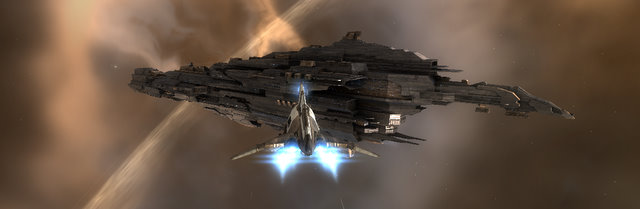

Back to: [West Karana](/posts/westkarana.md) > [2009](/posts/2009/westkarana.md) > [October](./westkarana.md)
# EVE Online breaking news: CVA dissolved

*Posted by Tipa on 2009-10-28 18:20:17*

The mega-EVE alliance Curatores Veritatis Alliance (CVA), one of the alliances that keep the nullsec Providence region mostly safe and pirate free, was dissolved today. [CVA leaders are calling it an account hacking](http://www.eveonline.com/ingameboard.asp?a=topic&threadID=1205265) and have vowed to either get CCP to roll the hack back or to form a new alliance from the ashes of the old.

Reaction from the community has been mixed, [with many glad to see the end of the alliance](http://www.eveonline.com/ingameboard.asp?a=topic&threadID=1205168) that more than any other, set the tone for Providence and unabashedly claimed it for the Amarr empire, sworn enemies of my own character's Gallente Federation.

We've had our own run-ins with CVA, but I can't claim to know them well enough to be sad or happy at their disbanding, but I will admit our corp has enjoyed the relative safety of Providence during their reign.

---

Update: Looks like CCP may restore CVA? If them, then why not BoB?

[23:57:16] lasterax > GOOD NEWS
[23:57:21] lasterax > CVA WILL BE RESTORED PER GM
[23:58:04] lasterax > DO NOT SPREAD AROUND PLEASE ALTHOUGH I JUST SAID IT IN ALLIANCE NICE

----

One of our corp directors is on the scene, and sends back these screenshots of some of the fleet battles taking place in formerly-placid Providence space right this minute! Click on each to see the big picture.

[gallery link="file"]
