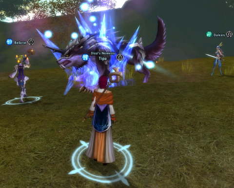
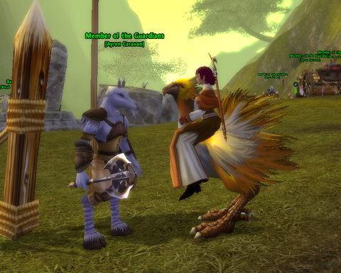
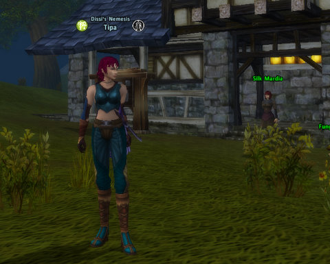
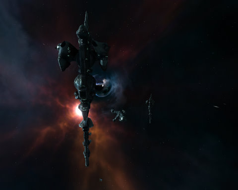
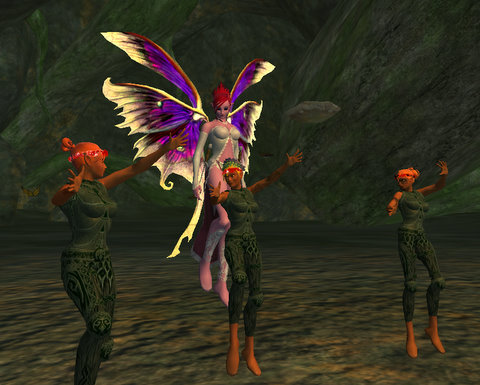

Back to: [West Karana](/posts/westkarana.md) > [2009](/posts/2009/westkarana.md) > [September](./westkarana.md)
# Quick Updates: Runes of Magic, EVE Online, EverQuest II

*Posted by Tipa on 2009-09-21 07:01:27*

I'm really enjoying Runes of Magic. When I first saw screenshots for the game a year and a half ago, I called it a WoW clone and didn't think much about it, and this does turn out to be a game that knows its market - WoW players. Most keys work the same as in WoW. It definitely looks like WoW -- if the starting zone doesn't remind you of Elwynn Forest, then you never played an Alliance newbie, looking for a Hogger group. Though if you went looking for a Hogger group THESE days, you'd be talking to yourself, because it's not 2004 and everyone is way past that.

In RoM, everyone is NOT past that. There's lots of people around in all the main areas I've been to. I've never had trouble making or joining groups for the instances I've been in (Hall of Trials, Barren Caves) or to take on the various named elite mobs quests require, like for Wild Mane above. No question in zone chat goes unanswered, and nobody yells at a newb to "go back to WoW". Though there's a lot of WoW nostalgia going on in chat -- but it's always looking back to how WoW used to be.

RoM's classes include Warrior, Knight, Rogue, Priest, Mage and Scout (Ranger). If you're an elf (the only player race other than human), the recent expansion added the Druid and Warden classes. Where's the human love, huh? Once you level to 10 in your main class, you have the option of adding a second class to your build -- and are given an entirely new leveling path for your new class, a swamp and grasslands zone inhabited by goat people.

The multi-class feature means that every role in a group is open to negotiation. Someone's always going to have priest as a class, someone's always going to have a tank, someone's always going to be dps, so you add people to your group at random (even for the big named mobs) and then figure out who will play what. You have certain abilities of the second class available to you. I play a scout/priest. I've been a scout in a group, helping out with the healing when things got hairy. I've also been the main healer for a group helping out with the dps by plinking the mob with crossbow bolts while waiting for the bubble I gave the tank to wear off.

It's a good combo, scout/priest, because the scout abilities draw power from the Focus pool, and priest spells draw power from the Magic pool, so I can use all the big scout abilities I want without interfering with my ability to heal. I was a priest in World of Warcraft, and I REALLY APPRECIATE the ability to slot in a high dps class as my secondary and have no trouble soloing.

RoM wants to make things easy for you. For many quests, you can see the quest giver and the quest end NPC on the map. Often times you can just press a link in the quest and your character will just automatically run to the NPC. If you need to kill a monster for a quest, it will show up on your mini map, and hovering over it will tell you what quest it's for, and how many more you need. 

Runes of Magic takes the basic World of Warcraft formula and brings it up to date. If you're looking for some of the old WoW sense of exploration and grouping to take on the big bads along with the ability to define and shape your own unique class by picking and choosing skills from any two of them, you won't go wrong with RoM. Plus, it's free to play (though you will likely want to buy a mount from the cash store).

This last weekend was the seventh EVE Alliance tournament, where the top Alliances in EVE get together and duke it out, fleet vs fleet. Watching that teaches me that PvP in EVE is a very, very complicated endeavor, and fleet PvP requires a LOT of strategy and teamwork.

We had our own taste of PvP in the corp this weekend. Director "Red" Sredans announced a wormhole op for Saturday afternoon. Last time I took an expendable cruiser into W-space, but this time, since we were going to go up against the Sleepers, I took my Myrmidon battlecruiser, "Not This Time". I might have taken my Dominix battleship instead, but I'd blown that up the night before trying to finish a level 3 mission that had turned a little hairy.

Red discovered a wormhole not far from our target system. We gathered outside it -- Red in a Raven battleship, two Myrmidons, an Exequror cruiser and a Tristan frigate. Red went in first and found an Apocalypse battleship on the other side, which immediately engaged Red, but fled as the rest of us made our way through the wormhole. 

We showed him...

We discovered a Sleeper outpost and were taking them down. Red was drawing a little too much fire and warped back to the wormhole to repair... where he found that the Apoc had brought back some friends. Several battleships. They'd deployed a warp disruption field so that there was no escape (not in a slow-moving battleship, anyway). They tore him apart.

Directional scanners showed enemy probes running throughout the system, looking for the rest of us. We jumped from one deadspace point to another, but it would only be seconds before the probes closed in. Someone thought they'd found a second wormhole in the system and warped us all to it -- but it was just that first wormhole again, and that was that. They cut my Myrm in half, then podded me.

Nirruden has [a little post about it](http://www.graffe.com/forums/showpost.php?p=1538587&postcount=22) over on the Graffe forums. It's easy to see from all the resources he found just why the enemy corp wanted to keep people out of its wormhole.

The corp replaced my Myrmidon (and my Domi! Thanks, Red!) so I was back and flying in about an hour in the Myrmidon "If You're So Smart". But, better than before, since I'd trained a lot more skills since I last fitted a battlecruiser. I also bought another battleship, a Megathron, but I'm a couple of months from being able to fit either battleship properly.

This week, [the Shard of Love goes live in EverQuest II](http://eq2players.station.sony.com/news_archive_content.vm?id=3249§ion=News&locale=en_US). This single group zone scales to the group level, so everyone should be able to jump in and see what became of the Goddess of Love, Erollisi Marr, since her tragic death.

Well, it hasn't done any favors for her home, which looks to be the decayed ruins of what was once a pleasure paradise. Players will learn more of the story and earn appearance items (like wings! everyone wants wings! even if you have wings, you want MORE wings!) and other cool stuff. I'm looking forward to it. Hey, I played on EQ's Erollisi Marr server!

This weekend was the monthly mushroom ring instanced adventures, so I went around to them all and did the quests, earned more trees for the blossoming forest in the basement of my Gorowyn apartment, and dinged level 32 on those quests alone! I'm right on schedule for a new level every 3-4 months :)

And that's pretty much what I've been playing during my "stay"-cation. Back to work and my regular blogging duties starting today :)

