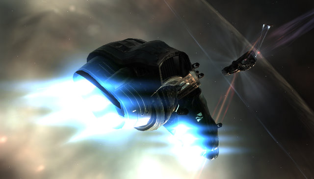

Back to: [West Karana](/posts/westkarana.md) > [2009](/posts/2009/westkarana.md) > [September](./westkarana.md)
# EVE Online: First PvP ops

*Posted by Tipa on 2009-09-29 22:46:06*

My luck held out, and I flew the *Gun of Happiness*, my PvP-fitted cruiser, back home. Everyone else in our null-sec adventure -- on our side, anyway -- got sent home via express mail. But we hit them first, and we hit them hard, but they soon outnumbered us and that was that.

We'd been planning on a PvP op more than our usual wormhole exploration for awhile. Red had scoped out some NPC complexes in low security space. We could play around in those and if some other players happened past -- BOOM.

This must have been a holiday for EVE pilots, though, for in one lowsec system after another -- no pilots! We split up in each new system, checked every asteroid belt for players or NPC battleships and battle cruisers -- and if we found those crunchy NPC villains, we'd gather together, take them down, and listen for that unmistakable clickclickclick as the pirate bounties hit our wallets.

All that was left was to leave behind even the scant safety or lowsec for nullsec, the lawless domain where things that matter happen. Where pro players would eat up PvP noobs like ourselves, even though we evened things up a little bit by being in a fleet. Red was the only one who brought real firepower, a Raven he'd been testing and tuning all evening. I was in my cruiser -- packed to the hull with electronic warfare stuff and a wide selection of drones, but unable to take any real heat. We also had a Stabber (cruiser) and a Rifter (frigate) and ... another ship, I can't remember.

First thing we found in the 0.0 system was an ice field -- I didn't get a picture of it, because we'd already started splitting up and someone had found a couple of players in a belt -- one in a Dominix (battleship) and the other in a Drake (battlecruiser)? Or was it a Raven? Anyway, the rest of us warped in and immediately set on the Domi. They'd been fighting some NPC pirates (rats) but they hadn't taken any damage that we could see. I came in a little late, but I did get there and unleashed my ECM drones on the Domi. Well, actually, on one of the NPC ships by mistake. But I corrected it and circled in to a tight orbit so my guns would be sure to hit, and the Domi wasn't packing something unusual like smart bombs, anyway.

The Dominix held out a VERY long time, and was still getting shots in. The Drake had warped out or been destroyed (we got a kill mail on it, so it did get destroyed at some point). We killed the Dominix just as their cavalry arrived. Red hung back while the rest of us headed for the hills, but only I was lucky enough to get away. I was just fortunate to be at the end of their list.

I knew heading to any gate would be suicide -- if I were them, I'd be watching all the gates looking for survivors. The cursing as one by one, our fleet was podded, convinced me to just hang in deadspace and be very quiet. I eventually just logged out in deadspace, because what else was there to do? Trying to escape would be suicidal. We were in nullsec, surrounded by lowsec. There'd be no help.

Still -- we did get two kills. Next time, we need to bring more ships and have a REAL battle. I'm glad my Vexor got away, but it's not right to put all the big ship burden on Red, so next time I'll have a Brutix (battlecruiser) fitted. It's not going to be as powerful as my Myrmidon, but I think it would be best to stick with drone boats for now. We do have the killmail for the Dominix we killed, and I'll be using that as a template to fit my own out at some point.

Now to log in and see if the coast is clear... it's been a couple hours....

