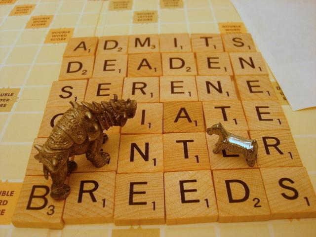

# Off to Virginia, but first, a puzzle:

*Posted by Tipa on 2010-01-25 08:17:54*

I'm driving to Virginia today to visit my son. So I'll be gone a couple of days, but the Adventures in Monopoly crew have been playing Scrabble, and came upon an interesting board position. So while I'm gone....

1) What was the last piece placed?
2) In what order were the legal plays made?
3) If Bear moved first, who won?

See you Wednesday!

**(Update: a couple possible answers in the comments)**
