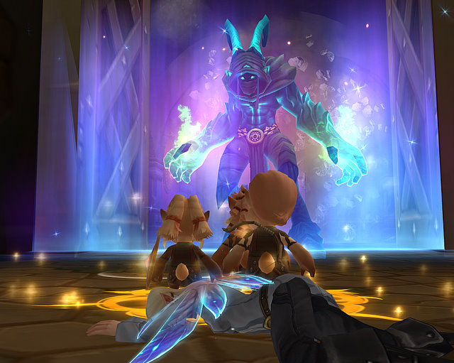
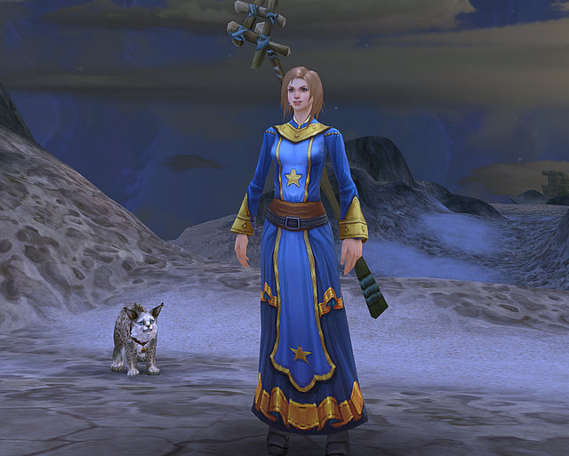

# First Look: Allods Online

*Posted by Tipa on 2010-02-17 07:23:31*

After helping to save dozens of people from the destruction of their doomed Allod -- an island floating in the Twisting Nether -- my gibberling crew defeated a ravening demonologist, lured a marauding demon into a trap that meant its doom, defended a powerful sorceror as she strived to keep the island afloat just a few more seconds, and finally escaped at the last moment to safety, regarded by all who knew them as a new breed of hero.

... only to land shoulder-to-shoulder with a thousand other legendary heroes, fighting with each other over crabs on the shore, deer in the forest, and snakes in the grass. Someone (not me) noted recently that some MMOs open up with cinematic, heroic openings where you save the world/city/universe/all of creation before being shown just how much of a non-entity you really are (Champions Online, Aion, Star Trek Online, Allods Online), while others just promise you greatness at some point in the future (WoW, EverQuest, Dark Age of Camelot). But when everyone is special, nobody is (that was Dash from The Incredibles, but no truer words have been written).

Gameplay is entirely standard. I have only played the Warrior to level 4 (as the triple-bodied Gibberlings) and Druid to level 6 (as the human Karnians), and in neither did I notice much of a difference from WoW, except perhaps that you get things so much more quickly. I got Charge on the Warrior before I was out of the tutorial, and the Druid got her pet right from the start -- and a long-lasting regeneration buff after the first few quests. The kinds of things that WoW holds back from for awhile -- like class-defining abilities and talent trees -- are present in Allods from the beginning.

But that is not a problem. Their target audience is the World of Warcraft player, and anyone who has played WoW at all is very familiar with how these things work.

Graphically, the game is beautiful and runs smooth as glass. There was some rubber-banding and a little lag last night, but that was better than I expected given the number of people crowded onto the two North American servers. A lot of attention has been paid to making the game just look absolutely incredible.

The chat system could use some work. I couldn't find an easy way to turn off the local zone chat, so I just switched to the Combat tab, where I wouldn't have to read the awful, horrible garbage being broadcast to the world. What a cesspool. I imagine things will improve once out of the newbie areas.

The leveling was nicely paced. The game helpfully gives you plenty of information on how you are doing, leveling-wise. The map is great, with the locations of quest objectives clearly marked out. Helpful tips always seem to appear just when you can use their information.

I've only spent a couple of hours in-game, but it's already clear that Allods Online is a wonderful addition to the stable of WoW-like F2P games that include Runes of Magic and the upcoming Alganon. The world PvP and the communal void ship navigation at higher levels will likely serve to separate Allods from its competition. For me, though, at my low level, starting a new character in Allods feels identical to creating a new alt in WoW, except more crowded.

You can find me playing on the League side on the Nezeb server as Tipa (Human Warden) or Winken (Gibberling Warrior). (Yes, my Gibberlings are Winken, Blinken and Nod ;) )

