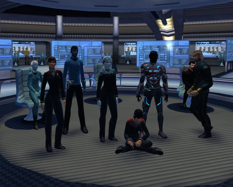

# Star Trek Online: This is your Federation News Service

*Posted by Tipa on 2010-03-31 22:25:46*

It took a lot of waiting around, but on this stardate, the Federation News Service (thanks, Ark, for the awesome name suggestion!) became the latest fleet to roam the space lanes, seeking out new adventures and stories and so on....

Now that we have a fleet, maybe it's possible to get enough people to do the raidisodes?

If you'd like to become a part of the Federation News Service in Star Trek Online, hunt up one of the senior editors -- @Caylinn, @BlueKae, @Tipa, @Vannikar, @khaaaaaaan!, @Aurangzeb or @camenecium -- for an invite!

