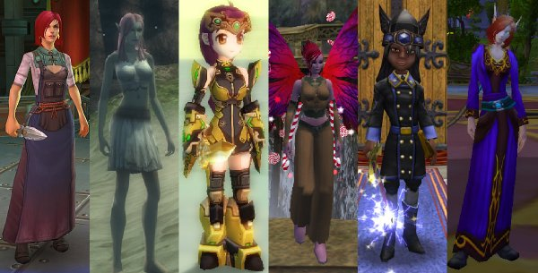

# The best MMO for a new player?

*Posted by Tipa on 2010-04-14 06:51:40*

Reader Velmonte asks:

> Tipa, what game would you consider for a person who is just breaking into the world of mmo’s? One of my friends, has been wanting to try one, but I need to suggest a game that has basic quests, but is still fun, colorful, and immersive. I was hoping you could help me out! Thanks!

This is a really great question. With new MMOs coming out every day and hundreds to choose from, it can be crazy trying to find the perfect game. Fact is, maybe you can't find the perfect game first try, or maybe after playing an MMO a bit, you find yourself ready for something new.

The most important question to ask when looking for a MMO is, are my friends playing this game? MMOs are all meant to be played with other people; otherwise, single player RPGs like Bioware's excellent Dragon Age: Origins will give the adventure, quests and party building without worrying about finding other players.

The second consideration is, will this game work on my machine? If you have a MacBook and don't want to use Boot Camp to boot into Windows, your choices are very limited (but there are some options). If you have an older machine, you may not have a great experience with some of the later games.

I haven't played every MMO out there, but I'd like to go through some of the games I have played with an eye toward the things (aside from friends playing) that would be most inviting to a new player. I'd look for interesting game play, games that start off easy and gradually show their depth, great graphics, great character customization, and active new player communities.

**World of Warcraft** must be mentioned first; it's the MMO so popular that when most people think of the genre, they think of WoW. WoW's content is famously easy, with the changes made to the game over the past few years making it one of the easiest MMOs to play, ever. It is colorful and runs on most any computer, even the Macs. Character customization isn't the best -- you will find your character's face on lots of other people's characters -- and the community at this point is expert at WoW and unforgiving of new players. The newbie areas are also largely empty, though that should change when the next expansion adds two new races and completely redesigned newbie areas. Also, the Looking For Dungeon (LFD) tool makes finding groups automatic, but you will find that most dungeon groups expect every member to be extremely familiar with each dungeon and able to handle each encounter with little or no discussion. WoW does so many things right, that it's easy to overlook the very few things it does wrong.

**Lord of the Rings Online** started out playing much like WoW, but in the years since has found its own niche. LotRO is deeply based on the lore of J.R.R. Tolkein's books, and your character will follow, lead and meet the Fellowship and together you fight the evil legions of Mordor and restore peace to Middle Earth. Your character is far more customizable, and you can equip gear just for show to give you complete control over your character's appearance. With housing, frequent festivals and celebrations and a variety of non-combat skills like playing actual music on in-game instruments, LotRO has built itself a strong and newbie-friendly community. Its high system requirements are the only blemish on this excellent game.

The sequel to the grandfather of 3D MMORPGs, **EverQuest 2** takes customizability to an entirely new level. Its housing and massive guild halls make interior decorating a popular player occupation, supported by many trade skills. Crafting is a respected career path, with no combat at all required if you want to pursue that path (although most crafters mix adventuring in with their knitting). EQ2 boasts several stellar newbie experiences deep with plot and lore, so you are immediately immersed in the world. From the faerie-like Fae to the dark and manipulative dark elves to the wandering frogloks to the conniving ratonga, no other MMO gives you the number of classes, races and individuality of EQ2. This does mean that EQ2 can seem daunting to a new player. Like many older MMOs, the newbie areas will be largely desolate and the groups you do find will assume you know the game well. The game also requires a fairly hefty computer, and few would call EQ2 colorful.

**Wizard101** is one of my favorites. The game is colorful, features a unique combat mechanic involving playing cards and building decks that starts out simple but leads to great depth, and has a variety of non-combat activities like home decoration and crafting. Though the game is nominally a subscription game, you can play the first several areas for free to get a taste, and have the option of purchasing access to new areas instead of subscribing. The characters, though colorful, have little individuality -- you'll see many copies of your character in the world. The game is also targeted for children and young teens, though many adults do play. The chat censoring and other kid-friendly features may be off-putting to older players. The game runs well on low system requirements, and I considered W101 to be the best new MMO of 2008.

**Free Realms** is an odd little nugget of an MMO. The developers couldn't decide upon just one theme to the game, so they put in everything they could think of to make a game where the only goal is to make sure you are never more than ten seconds from doing something new. Characters can have one or many jobs, evenly split between combat jobs like brawler and ninja and non combat jobs like miner and postman. Each non-combat job opens mini-games, often themed for the area, based on some of the most famous casual games ever made. Add in player housing, pet training, the occasional live band performance, everywhere a new game to play, and a player population recently reported to be 10 million strong, and you have an unmatched new player experience. You will find clones of your character everywhere, and the highly stylized player characters may not be to everyone's tastes. The game is free to play, though the cash shop is heavily promoted.

Out of all the Asian imports I've played, **Dream of Mirror Online** was probably for me the most successful. Your character is drawn from the real world into a mirror world full of Mirror Kings and only you (naturally) can save the world. Follow the plot through cut scenes, mysteries, and bizarre and over-the-top boss battles in various parallel universes, or discover and breed rare pets and hang out in town socializing, it's up to you. The fairly unique class system lets your character take on any role and mix and match the abilities from any two classes to make your character your own. (This system is somewhat similar to FFXI Online's, and Free Realms has echoes of it as well). Since each new class means going back through the newbie areas, even a couple of years into the game's Western launch, the newbie areas are still full of players. The real-time harvesting is a way to get some of the drudgery of harvesting done without having to be physically present at the computer. If you don't mind a strong anime/manga bend to the graphics, this might be the game for you.

Any of these would, I think, be an excellent introduction to the world of MMOs, and perhaps a permanent home for a new player. Other games, like Dungeons and Dragons Online, EVE Online, the original EverQuest, Aion, Warhammer, Age of Conan, Darkfall and Allods Online would appeal more to the experienced gamer. Most of these games have demos or free trials, and I'd urge a new player to give a couple of them a try to find out which appeals to them most. If you aren't having fun in a game, it's best to just move on. There's so many choices available these days that there's bound to be a fit for everyone.

If someone is looking for a deep game full of story and lore and "worldness", and their computer can handle it, I'd recommend Lord of the Rings Online. For sheer casual fun, Free Realms. For kids or adults looking for a more strategic but always fun game, Wizard101. For the most freedom and individuality, EQ2. For the best social tools, DoMO. For the easiest game that can run on anything, WoW. Whatever you are looking for, one of these games likely has it.

