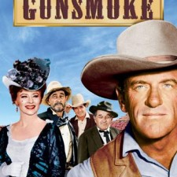

# IPs that SHOULD be MMOs part 1: Gunsmoke

*Posted by Tipa on 2010-05-04 23:28:34*

A good intellectual property (IP) can more than provide a setting for a game; it can in a single word tell a player what his or her role is without even knowing one thing about the game itself. The very best IPs are open enough so that the game developers have plenty of room to grow beyond their starting bounds.

Westerns were big in the fifties and sixties. REALLY big. As many different sorts of crime shows are on today, were how many westerns were on back then. Every network had a few. The biggest of them all was CBS' [Gunsmoke](http://en.wikipedia.org/wiki/Gunsmoke).

Running for 20 years on television from 1955 to 1975, first in black & white and then in color, Gunsmoke told the story of Dodge City Marshall Matt Dillon, dance hall girl Miss Kitty, and a continuing cast that changed as show told its story of law and lawlessness, love, loss, drama, crime.... The setting was general enough so that almost any story could be told, and most of the western plots of the day had their time in Dodge City.

There hasn't been a Old West MMO yet, as far as I know. Rumors swirl. Tenderfoot Games' "[Wild West Online](http://www.wildwestonline.com/)" claims to be a MMO, but the site calls it a "single player or 1-on-1 multiplayer" game, which doesn't sound very massive to me. Other "Old West" MMOs are rumored and fall to pieces. What they need is a good IP to bring them all together.

In many ways, and perhaps not surprisingly, the best modern example of an Old West MMO would have been pre-NGE Star Wars Galaxies. The towns in far-flung locations, the saloon as a gathering spot, trading gunfire out of sight of the law.... Reskin SWG, and you're halfway there.

Players would start as a character with no particular skills. Wandering through Dodge City, they might see posters giving bounties on randomly generated outlaws. If they bring them back, they get their reward. If they bring them back alive, a better reward. Maybe the barkeep over at the saloon knows of a ranch that could use a hired hand, or someone to rassle cows. Maybe you could set up a small shop, or buy a deed and go homestead somewhere far off, or rise through the political ranks and get the train to come through your city. Or heck, plant a flag and start your own town and hire players to defend it.

As the game years progressed, crops would have to be harvested and shipped off, cattle would have to be driven to new grazing lands, negotiations with the local Native American tribes would seal beneficial deals or lead to war.

It would be wide open spaces everywhere you looked. A true sandbox game. There would have to be PvP -- it wouldn't be an Old West game without it. Like EVE, there would be towns that would provide safety from PvP most of the time. Smaller towns could be attacked by bands of outlaws now and again. Lone homesteads would have to see to their own defense, but for those who really want to succeed at Gunsmoke, building their own ranch in the middle of a thousand acres of land and keeping enough hired hands around to hold it would be the only way to go.

With the success of modern westerns such as Deadwood, 3:10 to Yuma and Unforgiven, I don't understand why we haven't seen a triple-A offering in the field yet. I think it's just waiting for that one golden IP to bring it to life.

Next up: If you're not a cop, you're little people -- rain and replicants collide in Blade Runner: the MMO.

