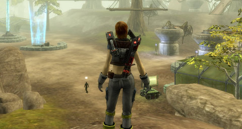
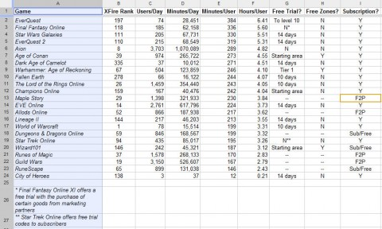

# Free2Play: The Remedy for All Ills

*Posted by Tipa on 2010-06-17 20:44:17*

Dungeons & Dragons Online started fairly strong for a new MMO, peaked early and fell into obscurity. People complained, loudly, that for a game built on the Guild Wars model (multiplayer hubs leading to solo/instanced content), they charged a bit much. Guild Wars, its inevitable competition, was after all free to play once you bought the box. Guild Wars also offered single player party play, a fairly unique combat mechanic and a strong RPG plot to take players through the story.

DDO, by contrast, had short story arcs called modules which had to be repeated *ad infinitum* in order to progress. Solo play was difficult for most classes. Turbine stepped up and fixed the flaws. They introduced many more modules, eased solo play with the addition of hirelings, and in the end, made a subscription optional. Similar to KingsIsle's Wizard101, players could purchase modules to add options to their gameplay.

It worked wonders. DDO was on everyone's mind; the population exploded with F2P players, and a good number of them opted to become subscribers and get everything for one monthly price. Nearly everyone would take advantage of the DDO Store.

Had Turbine caught lightning in a bottle, or was this the kind of lightning that never strikes twice?

Facing similar drops in subscribers, Mythic's Warhammer Online and Funcom's Age of Conan opened up their new player experiences to new players forever, no time limit. Players were encouraged to download the game for free and give it a try. The games are now both modest successes, having never reached the depths to which DDO had sunk.

DDOs move to "Freemium" changed the game for every "B" subscription MMO. Publishers had to ask themselves if Freemium could turn their game around. Someone would almost certainly point out that Freemium is something World of Warcraft simply would never copy. ANY game could do Freemium better than WoW. By shifting into a new revenue model, the WoW behemoth suddenly wasn't nearly so scary.

Bloggers fingered SOE and Cryptic as the next companies to flirt with "freemium". SOE had already published one MMO, Free Realms, with that very model. Cryptic's heavily instanced, zone-based games, Star Trek Online and Champions Online, would be a good match for the DDO model.

Turbine's announcement that The Lord of the Rings Online would follow Dungeons & Dragons Online into freemium territory was a bolt from the blue. LotRO was not considered a failure by any means. XFire ranks it as the #4 subscription MMO in its list, behind only WoW, Aion and EVE Online. Like those others, LotRO is an open world game.

Unlike DDO, though, LotRO does not stray far from the MMO norm. Where DDO only really competed with the fairly old Guild Wars, LotRO's move will place it against such F2P competitors as Runes of Magic and Allods Online, lush F2P games that were designed specifically around free, open game play with very optional cash shops. LotRO by contrast would turn most of the world silent, unless you buy quest packs -- only the starter area quests are given for free.

Since it is difficult to level in LotRO without doing quests, this essentially requires players to buy the quest packs. At least, anyway, until they can do skirmishes in their 30s.

Unlike DDO, LotRO was always considered a "AAA" game, made with the highest production values and very popular. With many free weekends and other promotions, it's likely that almost everyone who had an interest in the game, also had a chance to play it. DDO's star fell too quickly for that.

Here's the crux. The game is still pretty much the same as it ever was. If you're still a subscriber, nothing changes for you. If you'd subscribed but let it lapse, you'll still find the game as you left it. If you tried it and didn't care for it, nothing will have changed enough to change your mind.

The Lord of the Rings Online is, I feel, too POPULAR to make the easy switch to "freemium". It might have worked for Tabula Rasa, might still work for Pirates of the Burning Sea, but LotRO has had its time in the sun, and if its fires are now cooling, I can't see the move to freemium as anything but a very risky move.

[caption id="attachment\_5216" align="aligncenter" width="480" caption="Click to enlarge"][/caption]

Just because I'm weird like that, I went to XFire and downloaded stats for a few MMOs. Now, I want to say first off that I don't trust XFire ranks AT ALL, and I think any projections of XFire users into total subscription numbers is just fantasy. However, these are not the only stats tracked by XFire. They also track the number of XFire users that have played a certain game each day, and the total number of minutes XFire users spent in that game.

I believe we can assume that XFire users are typical players of their games -- they wouldn't spend significantly more or less time in the game than a non-XFire user. So, dividing the number of minutes played each day by the number of players each day, should give a fairly accurate idea of the time an average player spends in game per gaming session. Click on the spreadsheet image above or check out the [Google Docs version](http://spreadsheets.google.com/ccc?key=0AqFuaaGk2ToudGNfT2tfUEpwejkydlp4emFySEZuVmc&hl=en). I've sorted the games not by XFire rank, but by the minutes/user.

The top half of the list is entirely subscription games. The three "freemium" games on the list -- DDO, Wizard101 and Runescape -- seem to have their success based on quick bites of adventure, and not the long, drawn out gaming sessions common to the more traditional MMOs. (I would be more thrilled with EverQuest's appearance at the top of the list if they didn't encourage people to stay logged in 24/7).

We can imagine that if World of Warcraft were suddenly to go freemium, that most everyone would choose to go that route -- and that those players who let their subscriptions lapse between patches and expansions would instead check in occasionally and perhaps end up playing -- and paying -- more.

Turbine's gamble will be proving that a "AAA" game can make up the potential loss of subscribers with revenue from thousands more free players using the cash shop.

I wish Turbine well, but DDO and LotRO are so different that I just can't see DDO's success saying anything at all about LotRO's.

