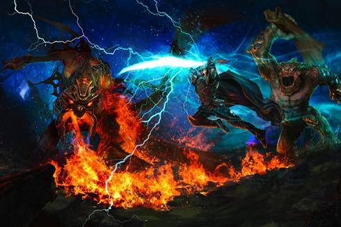

# Kingdoms of Amalur: Reckoning

*Posted by Tipa on 2010-07-20 05:55:49*

(This game will absolutely hook me if it becomes the first game to ever look anything like its concept art. Alas.)

We're going to get our first look behind 38 Studios' veil of secrecy this week when the gaming studio teases their non-MMO, Action RPG-ish game "[Kingdoms of Amalur: Reckoning](http://www.usatoday.com/tech/gaming/2010-07-20-schilling20_ST_N.htm)".

This is not the MMO we have known as "Copernicus", but a RPG (I don't know if it is single player or not) set in the same world and developed by Big Huge Games, which 38 Studios acquired last year.

World designed and famed author R. A. Salvatore says what they show at the San Diego ComicCon will set the stage for their new fantasy milieu and leave people hungry for more details.

> "We are going to set the mood," says McFarlane, who along with the other principals will make a presentation Thursday. "We will show a little bit of a hint of magic in it, a hint of the scale of the bad guys (and) the intensity of some of the action."

38 Studios has been very good at keeping their lips sealed about details of their games, but they have not been shy about promoting the huge talent they have brought together. Expectations are high, and with KOA:R, due out late next year (with the MMO coming along at some point later), they will have a tough job to keep fans excited over such a long stretch.

USA Today has [a long interview](http://content.usatoday.com/communities/gamehunters/post/2010/07/curt-schilling-and-38-studios-comic-con-news/1) with studio head Curt Schilling about this week's tease for next year's Reckoning.

Given the people involved with 38 Studios, I'm REALLY looking forward to what they have to offer. But there's a doubter part of me that wonders if they have been so reluctant to divulge any information about their game because what they have to show isn't particularly special?

We'll find out this week if "Reckoning" is the game that will redefine action RPGs (like Torchlight, Diablo, TERA and so on), or if it's just another iteration on a well-worn formula.

