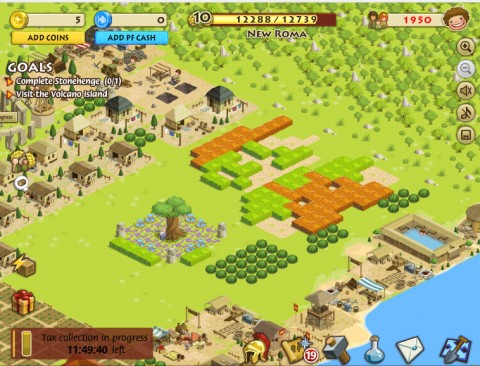

# Facebook Games Ho! Will Playfish' "My Empire" make you forget Caesar IV?

*Posted by Tipa on 2010-07-29 06:59:29*

"Facebook Games" as a genre have gotten a bad rep from core gamers, and it's not hard to see why. Take any Flash game, figure out how to add a cash shop to it and add in plenty of spam for those unfortunate enough to be your friends, *et voila*, you have now contributed to the glut of hundreds or perhaps thousands of time-hungry games clamoring for your clicks.

But it's not really fair to just dismiss what many call the future of gaming. If that's true, after all, what we like to think of as core gaming will become nothing more than historical curiosities by-and-by. With the help and advice of IT World's [Peter Smith](http://www.itworld.com/pasmith), I dipped a toe into these friend-infested waters.

First up was Playfish' My Empire (pictured above), a Roman-themed city building simulation. You build homes to increase your population, decorations to increase happiness, city buildings to increase fame and happiness and wonders to give you something to spam your friends about.

When I saw that the first wonder was Stonehenge, and the next, pyramids, I understood that historical realism was not a concern here, so I turned my island town into a shrine for Rome's most famous son, Mario.

As a way to connect with friends, My Empire falls short. There is not much reason to return multiple times during the day; nothing is going to go wrong in the town, and it takes only minutes to spend the money you earn from taxes. I have my taxes collected every twelve hours. The game requires LOTS of friends to play, or a willingness to pay real money, to get some of the grander buildings built.

As a game, My Empire is a poor clone of city building games like SimCity, or more pertinently, Imperial Rome-themed city builders such as the Caesar series (which I loved, back in the day), or 2008's [Imperium Romanum](http://en.wikipedia.org/wiki/Imperium_Romanum_(video_game)) (AKA Sins of a Roman Empire) (not really), available for a double sawbuck from Steam.

With only two stats to manage, neither of which impacts the health of your town in any way, and nothing much to do besides build new structures and beg your friends for resources, the game does little to advance the Civilization genre.

My advice: Skip My Empire, get Civilization IV (or Imperium Romanum if you ache for the Roman theme), and say goodbye to your nights and weekends as you lose yourself in the best city and empire building games you can buy.

