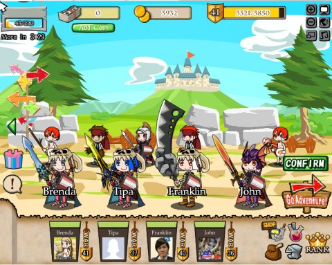

# Treasure Abyss: Where's the Dragon?

*Posted by Tipa on 2010-09-14 21:03:02*

***Quick Edit: Namco Bandai just added "Adventurer's Flags" to the Treasure Abyss cash shop. These allow you to plant a flag in the dungeon so you can return to that point later. Pretty handy for farming Dragon's Nest, especially the first couple encounters on floor 8 which drop pretty much everything you need for the Giant Sword. Also, the slot machines are a lot faster, and candles now show how much candle power they will restore. Dungeons are markes "CONQUERED" on the map after you have cleared them.***

Most Facebook games I just play until I understand them well enough to review them. I did play Frontierville a little longer than I absolutely had to because I wanted to help out friends, but I eventually managed the strength to block the application, ignore everything from that application, and just basically put it away. I went through my Facebook permissions -- there were a LOT of apps I knew nothing about with permission to do everything they wanted with my info. I got rid of them all.

You have to be harsh.

Still have Treasure Abyss, though, and all the dozens of people who I've befriended just so I can have their characters for my party, and they can have mine for theirs. 

Even with the new dungeon, Dragon's Nest (warning: no dragons were harmed or even used in the making of this dungeon), the game is fairly short. The only real challenge is making the powerful new warrior weapons; they've added one, the Giant Sword (a big piece of steel with a giant's fist still attached), and two previously revealed weapons that only now have become craftable, the Ice Brand and the Thunder Blade. (The wizard equivalents, the Ice Staff and the Thunder Rod, have also become possible to construct).

A little bit of a spoiler: the Ice Crest comes from the slot machine on the ninth floor. The Thunder Crest comes from the slot machine on the tenth floor. When I wrote my last post about TA, I hadn't yet found them. So after a lot of farming, I've made the new weapons, and with the help of a couple neighbors, I snapped a picture of a four warrior party with the four most uber weapons currently available: the Ice Brand, the Thunder Blade, the Giant Sword and the Flametongue.

With the help of Noffin/Michael and a lot of candles, we have figured out that the Thunder Blade is the most powerful of them all.

Since anyone can change to any class at any time merely by equipping the appropriate weapon, it's instructive to see what classes people choose. When the game launched, there was a good variety of wizards, thieves, warriors and monks. Then all the wizards vanished, and then the thieves, and then the monks. Everyone was a warrior! Now, today, a good third of my neighbors have become monks.

Why? Because after every battle, the game shows you how the DPS ranked up. Monks and warriors vie for first. Wizards and thieves are lucky if they even get one kill. 

There was a brief blip in the number of thieves when Namco Bandai announced that thieves would increase the money rewards, but that tapered off because nobody likes seeing themselves at the bottom of the DPS chart, MVP to nobody.

Anyway, with the final dungeon conquered, all that's left is the slow climb to 50.... but it's still the best Facebook RPG I've played.

