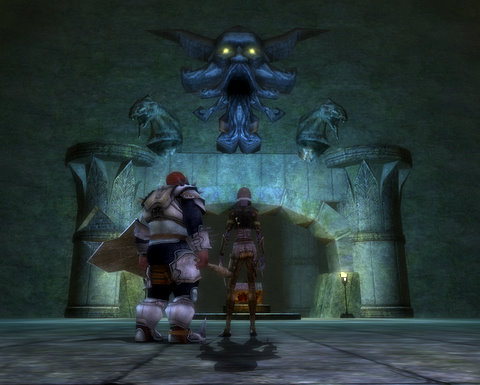

# Dungeons & Dragons Online: Adventure by the Bite

*Posted by Tipa on 2010-10-07 07:06:18*

There's a gulf between the MMOs I WANT to be playing -- such as EverQuest, where I currently have a max-level rogue -- and the MMOs I ACTUALLY play -- which, these days, are Dungeons & Dragons Online and Star Trek Online. (Wizard101 is on the back burner as we wait for the expansion).

EverQuest is famous for being a social, more 'sandbox' open world where reputation matters and the things you do have consequence. Well, not so much anymore; SOE has fully bought into the instanced adventure scheme and now, nothing anybody does has any effect on the world. But ONCE UPON A TIME, it did. The point being, though, was it WAS a virtual world, where you could just hang out in places and chat, role play, run events or do whatever you wanted -- and even occasionally pull on the heavy boots and wade into dungeons and battle for treasure.

DDO and STO are, in contrast, just thin wrappers of virtual world around packaged adventures. You sit down at your computer, choose a snack or a more filling meal from a menu of choices, go to the entrance, follow the script, and then you're done. You can return for another or move on to something else.

There's no sense of changing either world at all. The Seal of Shan-Ti-Kor will still sit, waiting to be found, at the bottom of miles of corridors beneath the Steam Tunnels, after I've spent an evening retrieving it. The Crystalline Entity will still harass ships in the Alpha Centauri sector, after a fleet has shattered it to a million pieces.

But when I do sit down to play, I find more and more that a packaged adventure is often exactly what I DO want. Certainly when our Sunday night static DDO group meets, we know we only have two hours; we want a two hour adventure, please. We're all real people with busy lives, and we don't have the time to soak in a virtual world for days on end any more.

This is how the definition of an MMO has changed in the last ten years. From virtual worlds where adventure awaits your discovery -- memorable places like Norrath, Brittania, Dereth and Albion -- to packaged bits of self-contained adventure in Azeroth, Eberron and the Alpha Quadrant.

Even the poster child for virtual world MMOs, CCP's EVE Online, builds its PvE experience around packaged (and repetitious) missions. I wonder if their forthcoming World of Darkness MMO will tend toward the virtual world or the packaged adventure. I'm hoping the former, but expecting the latter.

