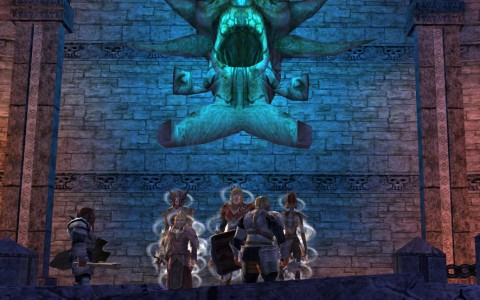

# DDO: Getting the Wight Out

*Posted by Tipa on 2010-12-13 22:23:50*

Yeah, that was the easiest trap to find EVER! We were running past and someone (I want to say Ulan, but it probably wasn't) suggested taking a screenshot of us. I'm like, great! Look at all these bridges and ladders! Perfect spot! And then they pointed out the giant goat head behind us.

First on the menu -- getting Ulan, our Friend from the North, into the exclusive ranks of the Order of Cannith. You know, I'd like an order of toast, an order of iced tea, and an Order of Cannith. Anyway, not just anyone can be a member of the Order. There's a long application that will take a few hours to fill out, and hitting the 'submit' button at the end gives you a PAGE NOT FOUND error. Then you'll have to talk to our HR person about doing a personal interview over Skype. Dress nicely!

Actually, I found out I had somehow become an officer. So I invited him in. Everyone was an officer! Spode was an officer! Gleek was an officer! Shy(sp?) was an officer! YOU'RE AN OFFICER! EVERYONE IS AN OFFICER!

And officers can change the guild message of the day.

Bwa. Ha. Ha.

First up: The Living Dead Girl's Notebook. That timed dungeon had driven Spode and I bonkers last week, but it was no trouble this week. Spode the ~~Un~~sinkable gallantly offered to watch the locked door open while the rest of us played in the water tunnels, which was kind of him :)

Next: "Free Delera", the middle quest in the Delera's Tomb series. You run around the dungeon unlocking five soul locks, all apparently built in order to keep Delera's shade trapped. Okay, let's pause here a moment.

Someone spent a LOT of money and a LOT of time building this dungeon and planting Delera within, making all these soul locks and everything. Did they not realize that ghosts and shades can be banished? Wouldn't that have been a LOT LESS TROUBLE? Like, they could hire a party of adventurers to "Kill Delera's Ghost so it stays dead this time", and then it would get done. Wouldn't that be a lot easier than "Spend ten years and millions of gold pieces to build a huge, sprawling tomb for Delera, install her ghost in it, seal it with five soul locks, then hire a party of adventurers to clear the dungeon, unlock the five soul locks and kill Delera's Ghost so it stays dead this time?"

In the end, we didn't kill her, but we did get her to talk to us. Something about a dread lord, undoubtedly fresh out of dread lord school.

Next week, we kill him.

