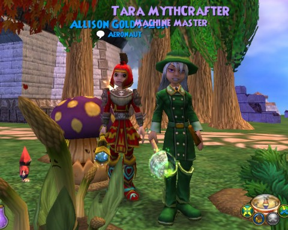
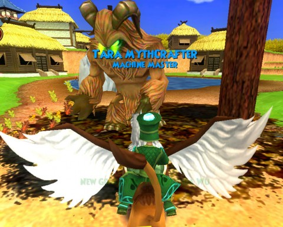
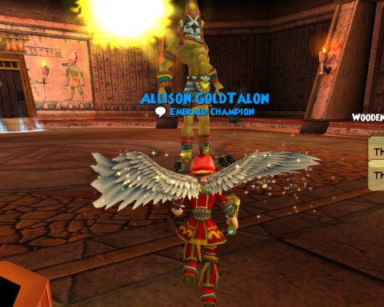

# Wizard101: Level 58, and I Feel Fine.

*Posted by Tipa on 2010-12-15 01:33:24*

It seemed level 58 would never come to my dynamic wizarding duo in Wizard101. Slogging through grindy grind after grindy grind. Last night, The Friendly Necro kindly help me kill a bunch of Megamind-style Minions in the Science Center for one sort of thing. THAT took forever. Then the quest continued -- I had to go back and kill the OTHER kind! Ugh! So I logged off.

But I could not stay away. I came back tonight, determined not to let the Science Center and its Hydrobots and Automatons and Hydrotons and Automabots get the best of me. There were plenty of people around, actually, and in full groups, the monsters did die and eventually coughed up their goods.

Both characters dinged 58, and it was time for new clothes and a new, class-defining spell.

First -- to the bazaar! Now that the legendary outfits can be put up for auction, there's no point at all in farming for gear. Leveling leaves you with lots of cash, so I just bought up the clothes for both my characters, and that was the end of it. I sure would have appreciated this during my Dragonspyre farming days...

Next, off to Grizzleheim for Tara's Forest Lord. One hitch: Tara, not having done Grizzleheim, did not have access to the zone. I'd duo'd Grizzleheim with Allison and my Myth wizard, Marissa. Tara had already been at max level when Grizzleheim was discovered, so I didn't see a lot of point in doing it for her. The experience in Grizzleheim, even at level, isn't that hot, but the treasure is very nice.

Anyway, when Allison finished her collection quest (Tara had finished first), I ported her to Grizzleheim and she let Tara into the zone.

The big bad for life wizards is a life boss with 13K+ health, and a storm friend with about 1.7k. Usually these signature spell quests are solo, but just for fun, I tried to port Allison in -- and she got in! 

Every time either character cast a trap or a charm, the boss would interrupt and cast a debuff on the caster. The boss DPS, therefore, got more critical with every buff or debuff we cast. The fight finished with Tara doing about 3K with a prism'd and bladed centaur, and Allison doing over 10K with a critical bladed and feinted Judgement. 

Tara went to Mooshu and got her Forest Lord. And then she went to the Bazaar and found some decent looking clothes to stitch onto her legendary items. She liked the stats, but the outfits are UGLY. And more than that -- every wizard in Celestia seems to be wearing them. A girl likes to stand out from the crowd.

Now, Allison isn't wearing that red outfit because the legendary clothes are ugly. She's wearing that outfit for her very survival.

Unlike Tara, Allison was not able to bring anyone into HER boss fight. She went up against a fire boss with about 8K health and a fire minion with about 1.5K. Same rules as with Tara's boss -- any buff or debuff cast got a debuff from the boss. Allison summoned minions to help, of course, but they weren't much help. Fairly soon, Allison was working too hard to stay alive to do any damage to the boss, and she lost her first encounter with no damage done to the boss, and the minion only down to half health.

There was only one thing to do. Build her resistances up to a point where the monsters simply couldn't harm her. Off to the Bazaar! I managed to build Allison's resistances up to about 78%; combined with her substantial number of available charms, even with the matching debuffs cast by the boss, spells like the dragon would do 70-150 damage. With only minimal need for healing, and aided by a fire minion that kept casting fire absorption spells on the boss, the fight was a lengthy one but the end was never in doubt.

Now, a couple of polymorphs would undoubtedly have taken up the slack, here. Maybe. I've gained a pretty low opinion of polymorphs from the actions of people in some pick-up groups I've been in. See, when you join a group in a duel, you look around and see what kind of wizards you are with. You assume that everyone knows what they're doing and will cast the appropriate spells, so you know what you have to work with.

Then someone casts a polymorph, and now they're dealing with a random assortment of cards and they just might as well have fled at that point. For solo play, I can see polymorphs having a place. But in a group, especially a pick-up group -- not a fan.

I could also have rented a wizard from the crowns shop, I guess, but I have to admit I only now thought of doing that.

Anyway, getting special resist gear just brings me back to EverQuest and WoW and the need to adapt your gear for the encounter, and I like that.

So anyway, it was off to the Palace of Fire to speak with Ra.

And now both characters have their shiny new AEs -- Tara's first. I can hardly wait to use them -- I've never seen either used in the game, so it should be some fun to watch.

Progress through Celestia? I have opened the Moon and the Star locks, and have just started on the Sun. Once that is finished, I think that gets me to the Temple of the Spheres -- the place where legendary gear is farmed. A farm I don't have to do :) And that makes me smile so much!

Picture up top shows part of my garden. I have a Giving Tree growing and am working my way through Rank 3. When the tree is grown, I'll get a better shot of the garden.

