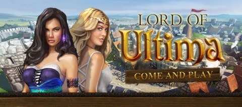

# Lord of Ultima Evony

*Posted by Tipa on 2010-12-22 22:09:34*

Shady browser strategy game Evony [has been long criticized for its deceptive ads](http://www.lazygamer.net/a-history-of-evony-ads-the-insanity-continues/) featuring scantily clad women advertising a game where you build houses and sawmills and really, have very little sex at all. And no women.

Must have crushed them when gaming megagiant Electronic Arts ~~stole~~ was inspired by their clever marketing and came out with an example of their own:

Lord of Ultima also features building stuff and sending out armies and no sex or women.

In retaliation, Evony has had to up the ante. Now its porntacular, stolen ad art features [blinking, glowing breasts](http://divagoth.com/2010/01/25/evony-steals-artwork-from-soe-adds-blinky-tits-to-the-mix/), as if to emphasize with no confusion allowed that these are the very things you can expect not to see if you play Evony.

Blogstar Krystalle spotted the first picture as the old EverQuest II mascot, and the second as a particularly uncanny valley-ish avatar from Second Life.

To be honest, you probably CAN find flashing boobs in Second Life.
