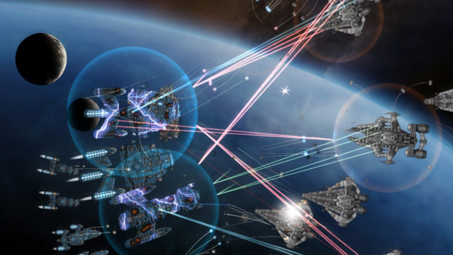

Back to: [West Karana](/posts/westkarana.md) > [2010](/posts/2010/westkarana.md) > [April](./westkarana.md)
# The West Karana Friday Offer Wall!

*Posted by Tipa on 2010-04-16 06:59:58*

Unlike other offer walls, this one probably won't infect your computer with anything TOO harmful.

Like watching pretty alien spaceships blow up in all sorts of interesting ways? I do! I bought [Gratuitous Space Battles](http://www.positech.co.uk/gratuitousspacebattles/index.html) the day it came out and every now and then, I build some fleets and watch them get crazy on the devious (but not as devious as me) enemy. Positech Games sent me a 25% off code for the game, good for seven days only, and two of those days have already passed, so if you've been wanting the game, be the first to use up this discount code when ordering: **BNXP00099**.

From now until Monday morning, Cryptic is having a 25%-off sale in its cash shop. If you've been wanting to get that new starship in [Star Trek Online](http://www.startrekonline.com/) or more of whatever you need from [Champions Online](http://www.champions-online.com/), [now's your chance](http://www.champions-online.com/node/594944). Now if this were Blizzard, your new sparkly must-have mount would be only $19!

It's not, though.

[Runes of Magic](http://us.runesofmagic.com/us/index.html) is also getting with the discount cash store program. From now until Sunday midnight GMT, prices for diamonds, their in-game cash store currency, are half off. If they were Blizzard, that would mean your sparkly must-have mount would be only $12.50!

Oddly compelling iPad/iPhone MMO [Pocket Legends](http://www.spacetimestudios.com/content.php?11) has some new items in its cash shop, too. Throwing weapons for the archer, shields for the enchantress, new two handed blades for the warriors. Unlike other games, you can buy anything in the cash shop with either in-game gold or money via iTunes, unlike sparkly mounts from Blizzard, which no amount of in-game gold will purchase.

To celebrate the release of the newest compilation of orchestral Final Fantasy music, Distant Worlds, Square Enix and Arnie Roth are traveling the world, partnering with local world-class orchestras and the occasional visit by compose Nobuo Uematsu himself, to bring [an evening of Final Fantasy music](http://www.ffdistantworlds.com/) to you. I can't think of much I'd rather do than attend, but none of the dates are anywhere near. Still, maybe you'll be luckier!

Did looking at this page infect your computer? Are you sitting on a sparkly horse RIGHT NOW? Do you wish the sparkly horse had come in pink instead of blue? Let me know!
