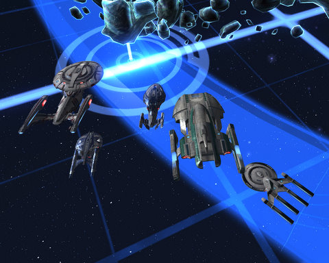

# Star Trek Online: Reporting from the Cardassian Front

*Posted by Tipa on 2010-04-23 21:13:11*

The Federation News Service (our fleet/guild in Star Trek Online) had its first fleet event tonight. Organized by Longasc, Commanders, Captains and Admirals gathered to take on some fleet actions. We headed to Tortig in the Regulus sector block and ---

Well, that didn't work. Level banding meant we couldn't all join the same instance. We decided to see if we could do some damage in some Deep Space Encounters, and "encountered" our SECOND mess-up; there can only be five ships in a DSE. Who knew? So if someone else was already in the encounter, some people would be sent into a new instance. I could have SWORN there used to be room for lots more ships in DSEs....

Well, once we knew what was happening, we were able to find a good DSE to call our own in Zeta Andromedae, and blew up Jem'Haddar ships with wild abandon. Enemy Dreadnoughts do a lot of damage, true, but they settle right down when hit with a Viral Matrix and a Tylen's Rift and the beams of five ships.

Was a lot of fun :) Missions got done, loot got won. Someday enough people will be Admiral-level to do the special task forces, but just fighting together worked out well enough. We got to see each other's ships, get an idea for the roles everyone would play in a group. This will make task forces roll much more smoothly when we do get to them.

But, really. If we're grouped, we should always be able to move into instances as a group. This being split between instances? Not cool.

