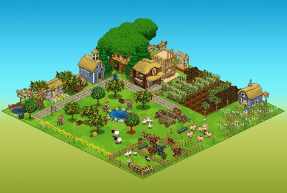

Back to: [West Karana](/posts/westkarana.md) > [2010](/posts/2010/westkarana.md) > [August](./westkarana.md)
# Thoughts on the social gaming explosion

*Posted by Tipa on 2010-08-27 18:52:43*

I quit Frontierville tonight. No big deal. I ended up playing it a lot longer than I thought I would, actually. I got to a point in FV where I'd just log in once in the morning and once again at night, harvest stuff, visit neighbors, see what folks were up to. Some people arranged their homesteads so that they just had mass herds of animals that they'd tend to; otherwise made gigantic farms; some folks just tried to make their homestead a pleasant looking place. There clearly could be a lot of creativity in the way the farms were laid out, and Zynga holds frequent contests to find the most innovative designs.

I was surprised to discover just how like an MMO Frontierville was. You level. You do quests. You group together with friends to do large tasks, but there's plenty to do on your own. And it never, ever ends. I'd like to say the only real difference would be the begging from your friends for help, but ... go listen to the general chat of any MMO out there. You'll hear that same thing.

It's not a mystery to me now why Richard Garriott is looking toward social gaming as the future. If a decent social game can keep someone hooked for a couple months, and a great one perhaps half a year, then you can make an entirely new game from scratch every six months and just ride the money wave. Such a quick develop/release cycle means you really have the chance to innovate and iterate -- a potent combination that could quickly move social gaming in directions we wouldn't expect from the glut of Farmville clones and city building sims that glut the genre.

Likely the most odious thing about these social games is the implied requirement to get lots of people helping you. I've seen people who must have fifty or a hundred people helping them; the forums for these games are jam packed with people begging for additional friends to help them along.

Play a few games that had you adding a couple hundred strangers to your friends list in order to progress, and Facebook will be useless for anything else, to you. Having quit Frontierville, I need to go through and unfriend people I only friended for that. But, they all seem like such NICE people, and why can't we be friends? And so I probably won't.

The example of All Points Bulletin, which blew $100 million on a game that lasted a month, shows only that when you fail on an MMO, you fail HARD. You could make hundreds of social games for that much money, and turn them out much faster.

With so many MMOs coming out these days, I'm feeling a little numb. Assaulted by screen shots; I can't remember the details from one to the other. I cling to a few high profile releases and no longer blithely install every F2P that comes my way.

A sheer overload of social games will do the same for the Facebook generation. There's only so many farms you can build, after all, and your friends won't follow you to every game you'd like to try.

So. I finished with Frontierville, Kingdoms of Camelot, Virtual Villagers and My Empire. Office Heroes will hit the paper shredder once I see if anything special happens when I hit max rep. City of Wonders has the rest of the weekend while I write an article about it. Then I'll be looking for something new, an RPG, perhaps.

If this is the future, I want to be a part of it.

*To answer my own question: Nothing special happens when you get to max rep in Office Heroes.*
