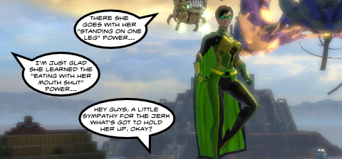

Back to: [West Karana](/posts/westkarana.md) > [2010](/posts/2010/westkarana.md) > [December](./westkarana.md)
# Daily Blogroll 12/29: Super Duper edition

*Posted by Tipa on 2010-12-29 06:00:33*

I long ago pre-ordered SOE's DC Universe Online, but this was my first opportunity to play it, in beta, on the PC. Though it's on the PC, the little picture hints and controls clearly expect you to be using a PS3 controller to play the game. I don't have a PS3 controller, but I do have a XBox controller, so I plugged it in and away I went.

In a niche genre already filled by [City of Heroes](http://www.cityofheroes.com/), [Champions Online](http://www.champions-online.com/), and ~~Avenger Babies~~ [Super Hero Squad Online](http://www.heroup.com/), it must be asked what DCUO brings to the table?

After admittedly only a few hours of play, I can think of two things right off: The Justice League and the PS3 integration. If you want to fight aside Batman, Superman, the Joker and their pals, DCUO is the only game that's gonna let ya. And if you want to play an MMO on the PS3, again, you have nowhere else to go but DCUO. On the PC, however, the cup runneth over, and there's nothing to particularly distinguish the game, aside from the strong and constant use of the DC milieu and characters.

Anyway, more on that later. On with the blogroll!

**DC Universe Online**

The Roadkill with the Greenish Hue [has a few thoughts on DC Universe Online](http://playervsdeveloper.blogspot.com/2010/12/early-impressions-of-ps3-dcuo-beta.html). He came away with a somewhat better impression than I did, but then, he's playing it on the PS3, as God and Sony intended.

**City of Heroes**

DCUO might be the new gunslinger in town, but venerable genre leader City of Heroes still has some life in it. Sente of A Ding World [romps around in the latest new content](http://adingworld.wordpress.com/2010/12/26/cylons-and-superheroes/) with news about all the cool stuff Paragon Studios has been stuffing into the venerable spandex-clad blockbuster.

**Gods & Heroes**

Mostly remembered as the game Perpetual Entertainment killed so it could try to save Star Trek Online before Cryptic inherited it, the rebirth of the collectible hero MMO proceeds apace with new developers, publishers, and a shiny beta to boot. Sounds like the game is off to a great start, with the gods of Mt. Olympus [throwing a New Year's Eve bash](http://massively.joystiq.com/2010/12/28/gods-and-heroes-celebrates-its-first-in-game-event/) and celebrating the birthday of one of their community managers.

I'm not sure it's wise to get so chummy with the pantheon, though. That never really worked out well.

**Craft of Worldwar**

Copra [had a notion](http://bullcopra.blogspot.com/2010/12/no-sandbox.html) to try and level a character in World of Warcraft as a pacifist -- without any unnecessary killing. In a sandbox game, you could have many paths through the game -- some bloodthirsty, others not so. 

Lord of the Rings Online has [a pacifist path right in the wiki](http://lotro.wikia.com/wiki/Pacifist_To_Level_10). In EQ2, you can reach max level without killing even one thing -- as a crafter. I'm not sure anyone has maxed out a non-violent adventurer character. But World of Warcraft, well... it says "war" right in the name. You're gonna end up killing someone in a war.

**Rift**

I had the hardest time getting the Rift beta working for me. The patcher kept giving me a 2002 Error: Unauthorized, even though everything looked okay with my account from the Trion side and from the account page side. To see if maybe my account was just borked, I made a new account and Trion accepted it into the beta. Worked fine. I guess there's a few reasons someone might get the 2002 error, but if nothing seems to fix it, it might just be your account.

The folks at fan site [Rift Junkies](http://www.riftjunkies.com/) have put together an impressive collection of starter guides for each other the game's four archetypes (or 'callings'). They've got build guides for [Warriors](http://www.riftjunkies.com/2010/12/27/a-newbie-survival-guide-to-rift-beta-warrior-souls/), [Mages](http://www.riftjunkies.com/2010/12/27/a-newbie-survival-guide-to-rift-beta-mage-souls/), [Clerics](http://www.riftjunkies.com/2010/12/27/a-newbie-survival-guide-to-rift-beta-cleric-souls/) and [Rogues](http://www.riftjunkies.com/2010/12/27/a-newbie-survival-guide-to-rift-beta-rogue-souls/) (and no, the Rogue guide is more than "don't play a rogue").

I can't say I 100% agree with their build suggestions, but follow their guides and you won't be gimped at all.

Agree with him or not, Wolfshead has his opinions and isn't afraid to share them, though typically always shaded by his experiences in World of Warcraft, which must have touched him in a bad place when he was a child. This time, [he turns his WoW-colored lens onto Rift](http://www.wolfsheadonline.com/?p=5243). 

He highlights a question in his article:

> Questing is quickly suffocating the MMO genre right now as most people have stopped reading quest text and are grinding them for experience, gold, items and reputation. Take away all of the rewards and incentives and I ask you: would players even bother to quest in MMOs

You might just as well ask if, without rewards and incentives, anyone would do ANYTHING in an MMO. Raid, dungeon crawl, PvP, log in... It sure would be a lot easier to develop an MMO if people stopped wanting those quests. The ironically named EverQuest lured players on, not with quests, but with the chance that the next mob might drop a rare item... okay, maybe the NEXT one... etc.

**Wizard101**

W101 community god Stingite, the Friendly Necromancer continues his march through the Spiral playing a character wearing nothing and wielding just the starter wand. He's just about to finish up the third world, Marleybone, [wearing nothing but what the Good Headmaster gave him](http://thefriendlynecromancer.blogspot.com/2010/12/angus-cues-up-for-big-ben.html). How far can he go? It'd be really cool to see someone do this in WoW...

**EverQuest II**

Lots of people are up in arms about EQ2's new cash shop race, the vampiric Freebloods, but I haven't seen anyone talking about whether or not they were fun to play. Kaozz at ECTMMO took the plunge and bought the Freeblood, the Freeblood Estate, the special "swarm of bats" travel form and so on [and shows them off](http://www.ectmmo.com/2010/12/freeblood.html) in glorious 24fps video. But the background music... "Barracuda"? Someone get that girl [some Sisters of Mercy](http://www.youtube.com/watch?v=dMFgYVA0-e4)...

**All MMOs Everywhere Forever**

Ardwulf read Ten Ton Hammer's [look back at the most notable MMOs of the past ten years](http://www.tentonhammer.com/awards/2010/decade) and [shared his thoughts on the matter](http://ardwulfslair.wordpress.com/2010/12/28/the-mmos-of-the-decade/). Was EQ's "Planes of Power" really the best expansion of the decade? Say what you will about EQ, but it was the game that invented raiding as we know it today, and PoP has still never been equaled for sheer depth. Then again, it also emptied the old world, making it and Luclin the expansions most old EQers blame for *killing* the game.

**Earthrise**

When I was a kid, "the future" was a cheery place mostly concerned with how to spend our infinite leisure time now that everything was free and robots did all the work. Now, you see the phrase "near-future setting" and you don't have to hunt far to find "post-apocalyptic". I guess everyone is pretty certain we're nearing the end times so, hey, might as well play a game!

Increasing the total number of post-apocalyptic by a substantial percentage and the number of Bulgarian post-apocalyptic MMOs by infinity percent, [Masthead's Earthrise is now scheduled to be released in February, 2011](http://www.play-earthrise.com/news/#20). Single server, player-driven economy, PvP, sandbox style game -- yup, it ticks off all the EVE checkboxes (and EVE Online itself is a post-apocalyptic game; in fact the lore suggests at least two apocalypses).

**Empire of the Immortals**

Perfect World International's announced [the start of closed beta for Empire of the Immortals](http://www.itnewsonline.com/showprnstory.php?storyid=136366), the sequel to its hit Battle of the Immortals. This new game promises "novel gaming experiences with a vast selection of vehicles built on ancient armory and weapons technologies". So, if you're looking for vehicle-based fantasy MMO gaming, you could do worse than look here.

I always thought a battle between immortals would be kinda boring after awhile. "You hit Boss X for a zillion HP! He doesn't die! You hit Boss X for ten zillion HP! He still doesn't die! He's immortal!"

**Herotopia**

And lastly, one more late entrant in the superhero genre -- [Herotopia](http://www.herotopia.com/), a game where you become a superhero and fight, not supervillains, but bullies. Yup. [Herotopia is an anti-bullying game](http://www.comicsalliance.com/2010/12/27/herotopia-mmorpg-superhero-bullying/). A game where you become a superpowered character, find someone weaker than you, and beat the crap out of him.

That will teach him to be a bully!

(Actually, it's mostly a minigame portal, but whatev)

Anyway, see you all tomorrow, and keep gaming!

