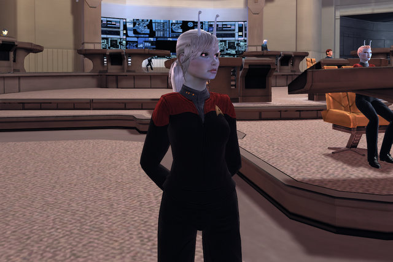
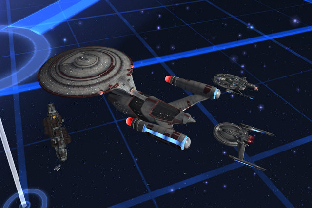
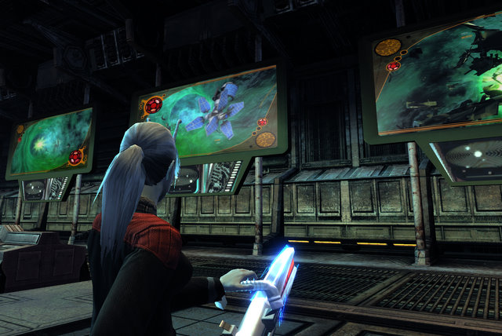

Back to: [West Karana](/posts/westkarana.md) > [2010](/posts/2010/westkarana.md) > [February](./westkarana.md)
# Star Trek Online: Taking Command

*Posted by Tipa on 2010-02-22 01:35:54*

I made Captain in Star Trek Online tonight; that's level 31 if you're all crass and number-using. We leave those sorts of things to our holographic life forms. They really seem to enjoy it.

As befits a captain, I traded in my Science officer blues for the red of Command. While I was at Deep Space 9 picking up necessary ship supplies, I picked up new uniforms for the crew. All they had were the DS9 uniforms, but that's fine. Black is very slimming.

I have moved away from science vessels. I find having the ability to tank and fire a substantial volley at enemies in space makes fights a lot shorter, and the game a lot more fun. I still do keep up with my science skills, which are a significant help in away missions and are game-changers in ground-based PvP, where I don't have my bridge officers to do all the fun things.

Before I leveled into a new PvP tier, I spent a few hours having burny fun with the Klingon Empire. Space PvP was frustrating; Klingons would swarm and take out every Federation ship in seconds, so that was more or less pointless. After I tired of hoping my ship's explosion would miraculously take out the Klingon fleet, I focused on ground PvP, where the matches went about 50/50, Klingon vs Federation. That's really where my Science abilities shine.

Eventually, I got to the point where I just wanted to level, dammit, and see my new ship -- the USS Manchester, seen above dwarfing the lesser ships near it. That thing is HUGE. As in EVE, you don't really get an idea for the size of your ship without something to show its scale.

It isn't a simple ship to fly. In fact, 'out of the box', the long range cruiser is nearly helpless. Earlier tiers could get away with ignoring power settings and using whatever consoles happened to come their way. Without the proper settings and gear, a long range cruiser would just sit motionless in space, firing ineffectually at the enemies who would have no trouble doing whatever they liked with the ship.

I boosted my weapon power up nearly to the max, with shields about normal, and speed and auxiliary systems slightly below normal. Engineering consoles (the l.r. cruiser fits three) boosts the speed back up to normal and manage the power flow to the various subsystems, while tactical consoles improve key weapon performance. The result: an express locomotive right down the throat of an enemy battleship. Ramming speed just adds a little *je ne sais quois* -- a little spice, perhaps -- to the mix.

Oh yeah, I've been telling the crew I'm going to get a new wall-sized plasma TV for the rec area. I wonder what the warranty is like on these...

I am 60% through Star Trek Online without really trying all that hard. I'm far enough through the game to take a look back. Is the game worth the year subscription?

I dunno. I really like the game, but it's not been out a month and I'm this far in. Just one last tier to go, and then I get to replay the game on the Klingon side. I've been assured that it's a LOT of fun, and I expect I'll enjoy it. That's four months, tops.

The storyline missions are wonderfully written and greatly add to the Star Trek lore. We do find out what caused the supernova that destroyed Romulus. We find out how the Romulans are planning to retake their empire. We meet all the exciting and powerful folks that Voyager stirred up on their way back to the Alpha Quadrant. And the Dominion isn't done with us, either.

Mixed in with the storyline missions are a host of very formulaic patrol and exploration missions. They differ chiefly in their rewards -- patrol missions give a large chunk of experience and usually a weapon or module that is better than most in its class. Exploration missions earn you badges of exploration that you can spend on even better modules, allowing you to customize the abilities of your ship to an amazing degree. I imagine it's possible to build a ship that won't fold up like the box it came in in Fed v Klingon space PvP, with the right modules earned through PvE.

Fleets (guilds) haven't made a huge impression as of yet. Not many of the folks in the STOTwitter channel seem to have joined a fleet; the chat channel seems to do all the things a fleet likely would.

The cash shop still only has the playable Federation Klingon and Ferengi races. People are waiting for new uniform pieces (or at least the ones available to pre-order folks), or new ships, but no sign of those yet. I DID pick up a Danube-class runabout on Deep Space 9, though. You wouldn't think it by how often they trashed those runabouts in Star Trek: Deep Space 9, but they cost as much as a Galaxy-class long range exploration cruiser.

The expectation is that STO will end in the rut that most MMOs fall in to. Unlike EVE, where all classes of ships have a purpose, even the ones a day 1 newbie gets, there's no reason ever to go back and use an older ship -- and hence, no reason at all to ever go back and do low level content. This will leave the galaxy filled with wall-to-wall admirals in huge and powerful ships, all waiting around to find out what rank exists beyond admiral. Supreme Leader? President of the Universe?

They would never do this, but I'd like to see STO let you start over as a new ensign -- in the Mirror Universe, the one where you have to carry an agonizer around with you in case you find you need punishment. Or as a member of the Time Patrol, or Section 31, or in the Kirk-era past where everything was far more primitive. Now that the movie has established a second alternate timeline (the Mirror Universe was the first), there's really no reason not to take the chance to explore all the nooks and crannies of the Star Trek universe.

If you've been hesitating about trying Star Trek Online, I'd suggest just going for it. Even if you level through the game in the free month, it's still well worth that $50, and you'll be ready when Cryptic starts adding the new content. If you're looking for a game that will keep you playing steadily for five years or more, I don't know. so much depends on how Cryptic sees Star Trek Online expanding.

But you'll get a really fun month out of it at the very least.

