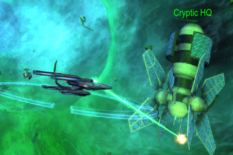

Back to: [West Karana](/posts/westkarana.md) > [2010](/posts/2010/westkarana.md) > [February](./westkarana.md)
# Star Trek Online: Cryptic fires back

*Posted by Tipa on 2010-02-26 08:03:20*

Cryptic responded to player concerns about the state and the direction of the game in a [huge, long, detailed producers letter](http://www.startrekonline.com/node/1182) that outlines their thoughts on the game as it nears the end of its first month.

Will this keep people subscribed while they wait for new content to come online?

Just picking a few details from the letter...

> Some of the few things on the way: 

 * Respec
 * Death Penalty
 * Difficulty Slider
 * More open auto-fire
 * Replayable missions
 * Improving Memory Alpha
 * Fixing those Commodity missions

Respec is nice. Cryptic took some heat over respecs in Champions Online when they added the respec ability to the cash shop. They also allowed you to buy respecs with in-game currency; I never really felt the sting. Here, though, I can't imagine someone not wanting to respec more than once as they level through the content, acquire new skills and weapons and so on. 

Death penalty is something that, according to this, players have been begging for. I *imagine* this will be the sort of equipment wear we get in World of Warcraft and similar games, and not a deep experience penalty or something bizarre like having to go back to a starbase to get a new ship. The EVE death penalty (lose everything) would just be inappropriate for a more casual game like this.

Difficulty slider? I imagine a slider to make the game MORE difficult. I don't see very many people being stuck in progression because of difficulty.

Improving Memory Alpha. Memory Alpha could be improved by nuking it from orbit. Seriously. We need REAL CRAFTING, not some sort of lame turn-in progression.

Fixing those commodity missions? I have one from Deep Space Nine. Apparently I have to find 160 resources and turn them in for 10 different resources to turn in for this quest. How could I GET more heroic?

More open autofire? I dunno, I just keep hitting ALT-SPACE. I think it would be cool to be able to target more than one ship at a time.

> Special Task Force: Infected
We're in the final stages of testing the first STF (the five-man raids we internally referred to as "Raidisodes"). STF: Infected is just about ready to release. 

I'm really looking forward to this. By the time they release it, I and four friends should be admirals. But, is there any point to repeating it? Will they let us repeat it?

> After Infected, we'll roll out more STFs. "The Cure", "The Khitomer Accord" and "Into the Hive" are all coming along nicely. We look forward to regularly releasing these and seeing what everyone thinks. 

I hope they plan on releasing all of these in a fairly short time frame. They NEED a high end game.

> Beyond Update 1?

Right now, we're planning it. We haven't set the future of STO's content into stone because so much of it will be determined by you, but we're laying out what we'd like to focus on for the next 6 to 12 months.

 * Who are the Undine and what drives them?
 * How can we better exploit the Genesis System to create even more compelling content?
 * Where can we boldly go next? Where shall we take exploratory missions, as there's so much potential there?
 * Which faction should be playable next? Romulan? Cardassian? Pakled? Dominion? Horta? Okay, not so much the Pakleds.

And that’s not even the start of it! Ship interiors, more bridges, crew quarters, First Officers, Fleet advancement... You have subscribed to a service that delivers a universe unending, and we shall see that universe populated with compelling content or, by the Prophets, we will die trying. 

Yes, I want to play a Horta :) 

All this stuff sounds great, but it's easy to write Producer's Letters, harder to push out actual updates. I'm subbed for a year, so I'm not going anywhere. I have been looking forward to this game since the first hints of its existence were floated by its previous developer, Perpetual Entertainment. I am still having a LOT of fun with the game, but I am interleaving it with EVE Online. I find they mesh well.

I'd REALLY like it if STO started stealing some of EVE Online's ideas, actually. I STILL want a reason to keep my old ships -- aside from looks. I'd like to see the players have some influence over the course of the war and the galaxy. If we're at war with everyone, let us win, or lose, or SOMETHING.

