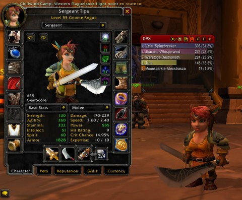
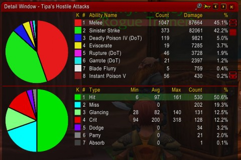

Back to: [West Karana](/posts/westkarana.md) > [2010](/posts/2010/westkarana.md) > [January](./westkarana.md)
# World of Warcraft: I suck at this whole DPS thing.

*Posted by Tipa on 2010-01-09 11:51:56*

Bhagpuss commented on [my previous WoW article](../../../index.php/2009/12/29/wow-behind-the-green-door/) that he never really cared to know how much DPS he was doing in a group, and was just satisfied if the instance went well. I can kinda see his point. It's a game, right? As long as you're having fun, the game is doing its job.

That's one way to look at it. I, though, was a rogue in EverQuest. EQ rogues have a lot more going for them than WoW rogues; there's a lot of things they can do that make them highly valued for their unique capabilities. They share with WoW rogues, though, the ability to do more single target melee damage than any other class.

That the dungeons I'm seeing in WoW seem built for magic AoE damage isn't important here. I have faith that at some point in time, there will be dungeons where mobs with lots of hit points come one at a time. I'll be ready.

[caption id="attachment\_4576" align="aligncenter" width="480" caption="Click to enlarge"][/caption]

I don't have the option of ignoring my DPS. In WoW classic 5 man dungeons, that's all I bring to the group. Nobody wants me to sap stuff or disable traps. For me to just be satisfied if the rest of the group could carry me through dungeons regardless of my performance would be really wrong.

I don't need to be THE best. I'm not an achievement-oriented gamer. I just would like to know I'm playing at MY best.

So, to that end, I installed Recount, to track my DPS and compare it against the rest of the group. I also installed the much-reviled GearScore add-on, to instantly judge [the level my gear](http://www.wowarmory.com/character-sheet.xml?r=Kirin+Tor&cn=Tipa&gn=Snacks+for+the+Horde) against that of the rest of the group.

This is necessary. If someone is doing triple my DPS, I need to know why. If I mouse over them and it shows their GearScore being a thousand points ahead of mine, then I know they are twinked with the special twink stuff you can get at max level, and I don't worry about it. If it's in the same area as mine, then they are likely geared in blues won from dungeon encounters that they earned on that character, as I am.

With good buffs, my DPS in Blackrock Depths is between 200-250. This morning, the random dungeon finder took me to Dire Maul East for the first time. You can see that Recount put me at the bottom of the damage chart. The bottom three characters on that list had approximately the same GearScores. The top two were heavily twinked. Warstoge was the tank, was buffed better than me and had AEs. Still, I usually am in the same general level of damage as the tank, usually somewhat better. I was drastically under the bar this time (and I expected to get a comment about that, but I didn't -- they were a good group).

[caption id="attachment\_4579" align="aligncenter" width="480" caption="Click to enlarge"][/caption]

I'd noticed that my poisons were resisted in the instance. Most of the mobs are plants, and plants are mostly or entirely immune to nature damage -- the sort of damage poisons cause. Reading through Recount's damage detail made it clear. My damage is usually split fairly evenly through straight melee, Sinister Strike (my combo point-building move) and poisons -- Instant Poison if mobs are dying fast, Deadly Poison if the are dying slowly enough for its DoT to make a difference. Since mobs were dying slowly (level 56-58, one to three levels above mine), I doubled up on Deadly Poison.

Now that I see how little effect damaging poisons have in the instance, next time I go I'll know to focus on poisons with other effects. Nothing seemed to run, so Cripple is out. There were a lot of casters, so the poison that slows casting times might be a good one to have.

That done, it was time to hit up the auction house and sell all the instance loot. Though I already have enough in the bank to pay for my flying mount at level 60, the transition from classic gear to Burning Crusade gear, what with the gems and all, is going to get pricey. My GearScore also hadn't changed much in awhile -- small upgrades from BRD now and then, or side-grades like the fist weapon I won last night, but nothing spectacular. My DPS in Dire Maul was so bad, though, that I had to take action. I couldn't rely on dungeon drops for all of my gear. I know that the best classic loot dungeons are still ahead of me, but my gear needs to be a certain level for the LFD tool to even offer them.

I did win a machete that increases my attack power vs elementals. I believe the trees in DM are classified as nature elementals, so that should help my dps considerably.

My gloves and belt, though both rare quality, had iLevels/GearScores well below the rest of my gear. Worship at the Auction House, and the Auction House will provide. I picked up two good upgrades and boosted my Gearscore fifty points.

I could probably just take what comes my way and not worry about my particular contribution to the group. I have only grouped twice with the same person more than once, I have absolutely no reputation to tarnish.

Maybe that's the old EQ training, though. If I don't know that I'm doing my best, it's not worth playing at all. There's no way I can compete with twinks, or the death knights I know I will soon encounter. I will never pass up an opportunity to compete with myself.

