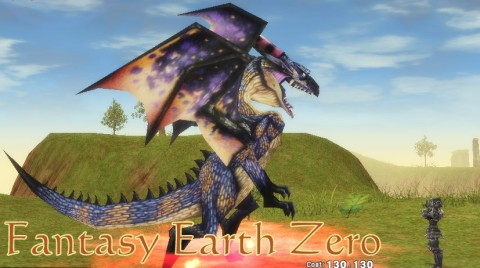
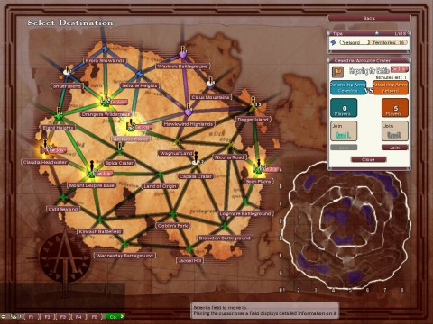
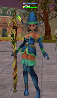

Back to: [West Karana](/posts/westkarana.md) > [2010](/posts/2010/westkarana.md) > [July](./westkarana.md)
# Fantasy Earth Zero review: MMORTS goes mainstream

*Posted by Tipa on 2010-07-04 17:48:46*

[Fantasy Earth Zero](http://fez.gamepotusa.com/) is a [Massively Multiplayer Real Time Strategy](http://www.massively.com/category/mmorts/) game originally published by Final Fantasy-makers Square Enix, but now by Gamepot USA. Although FEZ in some ways resembles a variant of the Asian free-to-play model (and it is now F2P), once you finish the comprehensive tutorial and are led to the main part of the game, the game's true nature becomes clear. The players are the soldiers in the massive armies of five nations, all vying for control of the rich center country, the source of the best treasure and resources. (A sixth nation sits apart, neutral, and is the only place where players from opposing nations may meet outside of battle).

Players characters choose between three classes -- warriors, scouts and sorcerers -- that share a rock-paper-scissors set of powers. Warriors can devastate scouts, scouts can one-shot sorcerers, and sorcerers can have their way with warriors. All the classes have a zero-cost power and a charge up move that allows access to higher cost powers. New powers are obtained by spending points after a new level; no character can learn all the powers available to them, leading to fairly unique power selections that the player will choose according to their natures.

Though there is a good selection of faces, hairstyles and body types available, in practice, people will be recognized by their outfits. The tutorial leaves the character at level 16 with a full set of decent clothes and a good weapon (as promised by the very first NPC you meet), but the smart player will extend that with outfits bought with either the in-game currency (gold, along with 'rings' for the better stuff), or with 'Arbs' (orbs), the cash shop currency. Arb gear is significantly better than gold-bought gear, and can be sold for rings to a recycler NPC when it is outgrown.

Combat in FEZ is active; you must put the targeting crosshairs over the intended target, and click to use a power. (You may use a gamepad if you have one). There is no auto-targeting or auto-attack, though the crosshairs are forgiving enough that it's still fairly easy to position them correctly even in the heat of battle. Many attacks are area of effect, extending from the target point or in a line directly in front of the player, making combat fairly positional for everyone involved. Additionally, most attacks are slow enough so that the alert player can move out of their way. There's even a special jump move that automatically evades all attacks.

The game leads the player through a basic starting clearing (here's how you move, here's how you choose your active power, here's how you kill something), then continues to a garrison. The garrison's captain has three letters needing delivering; the first brings the player through a low level area where they learn how to loot (important!) and how to skill up. The second teaches the player advanced skills, such as jumping, evading and gathering enemies together for those satisfying multiple kill shots. The third introduces the player to the battlefield, the player's first taste of the RTS portion of the game.

At character creation, the player chooses between one of five realms, each ruled over by a more or less benevolent warlord. All of them love peace, but understand that were they to abandon war, then their own nation would be invaded and overrun by the warlords of the other four nations. Thus, they must fight, and the best defense being a strong offense, they must win. A nation's capital city is always safe (as far as I know), but everything else is up for grabs.

A territory surrounded on all sides by its nations territories is safe, and may be used as a hunting ground (graded in tiers from one to four stars) for members of that nation to gain xp and loot by fighting NPC enemies. A territory that borders the territory of another nation is contested; when enemy players of the other nation enter the territory, after a period of time it becomes a battlefield, and the players of the two nations battle for control.

The battlefield has the main keep of the two armies at either side. Each has a large crystal, which will be mined by players to provide the materials for sphere of influence towers, fortifications, and summoning more powerful units. The battle is won by destroying the enemy keep.

Keeps are strengthened by building fortifications and expanding the sphere of influence; keeps are weakened by having friendly players die, losing sphere of influence and fortifications, or being directly attacked. Bar graphs show the relative strength of the two keeps, and the warlords for each nation will occasionally direct the players to areas where they will do the most good, or gently chide the player for not contributing enough.

Since players of all levels are mixed together in a battlefield, FEZ provides a number of roles for players of all levels.

Even the lowest level player can mine crystals. Crystals power the action on the battlefield. Higher level players need a constant supply in order to build fortifications or to call summons. Miners are given full credit in the final score window for their important contribution to the battle.

Slightly higher level characters can expand their nation's sphere of influence by building obelisks to extend the nation's reach, or seek out undefended enemy obelisks and fortifications and destroy them.

Most of the higher level players will be part of the grand melee which follows the action of the battlefield between the two keeps. Players will try to get enough crystals and the correct structures to summon more powerful creatures to the battlefield. While the creature is on the battlefield, the player abandons their character and controls this new creature.

Battles therefore tend to escalate; there is an initial rush to mine and build fortifications, war structures for summoning and sphere of influence towers; players summon mounted knights to destroy players, and giants to destroy enemy fortifications. Wraiths, chimerae and eventually dragons appear in the late battle as the correct structures allow their summons (dragon summons require a rare 'dragon soul' instead of crystals or structures). It all ends on the doorstop of a keep, and the territory is lost or defended and players are rewarded with rank, rings, titles and xp according to their contribution in mining, building structures, destroying structures, summoning creatures and killing enemy players. The titles are roughly equivalent to achievements in other games; I have a title for being a dragon in one battle and another for dying six times.

I'm not sure how many MMORTS games exist; this is the first one I've played, anyway. Even for a PvP non-fan like myself, it's fairly addicting, so much so that for a couple of days I haven't played many gamed besides FEZ. It's amazing how well balanced a battlefield is for players of such a wide spread of levels, with meaningful jobs for everyone.

Players who prefer solo play or a quest-driven progression won't find much to enjoy in Fantasy Earth Zero; the game is centered around massive battles between two armies, and I only found one quest -- to find and return a pair of glasses -- outside of the tutorial. Those who prefer games based on the World of Warcraft standard UI will also be a little out of their comfort zone; there is no similarity at all between the games. Everything is different.

If you're open to new challenges, massive, fast-paced battles and real-time strategy games, you definitely should give the game a try. It's in full release and you don't need to use the cash shop in order to contribute to your nation's inevitable victories over its numberless foes.

I've recorded a short, six minute video review of the game, embedded below.

**Extra**

Oh, still here? Okay, you find goblins in some of the PvE maps, and they occasionally drop a Goblin Book that identifies only as something that the goblins prize highly. The text in the book is a substitution cipher with some key misspellings to throw off solvers. I solved it this morning, and here's what it says:

> We goblin have secret information. Thunder Lizard have very good items. Must kill first to get item. Be careful! Thunder Lizard strong. But if you kill reward is good.

I don't know where Thunder Lizards are (probably four star maps), but I can't imagine we needed this book to tell us to kill any creatures that don't run away too fast. It's more or less what we DO. If the book had said, DON'T kill the Thunder Lizard, well, that would be different.
## Comments!
---
**West Karana » Fantasy Earth Zero Blogfail: Under the Radar** writes: [...] writing my own review of Fantasy Earth Zero a couple days back, I went looking for other reviews to find out why the heck [...]
