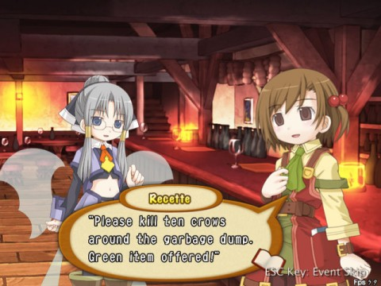
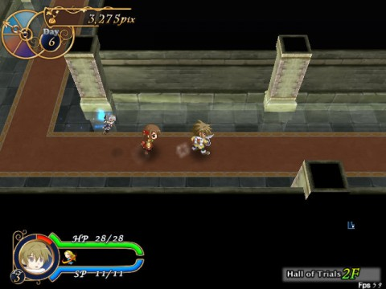
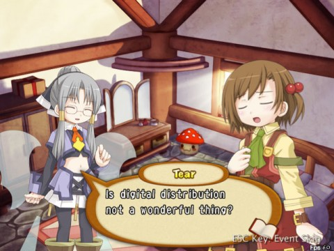

Back to: [West Karana](/posts/westkarana.md) > [2010](/posts/2010/westkarana.md) > [July](./westkarana.md)
# Recettear: An Item Shop's Tale

*Posted by Tipa on 2010-07-22 22:20:29*

If I could, I'd be playing [Recettear](http://www.carpefulgur.com/recettear/) right now. (It's pronounced Reh-keh-teer, not RACKETEER! How could you even think such a thing?) It's only out as a demo right now, and I've played the heck out of that.

Now and again you come across a game that turns the whole standard RPG tropes on their edge and come at them from a different angle. [Dungeon Keeper](http://en.wikipedia.org/wiki/Dungeon_Keeper) had you building dastardly, trap and monster infested dungeons that lured clueless adventurers in with dreams of easy loot but gave them nothing but messy deaths. In [My Life as a King](http://en.wikipedia.org/wiki/Final_Fantasy_Crystal_Chronicles:_My_Life_as_a_King), you take on the role of the town-stranded NPC who gives adventurers their quests. And in Racettear, you play the handy merchant always willing to sell a needy adventurer a handy sword or to buy some slime (+2!) from them.

Recette is a young girl with a song in her heart (called "Capitalism Ho!") and a fairy by her side. The fairy, Tear, is a debt collector (fairies always get the jobs nobody else wants). She wants Recette's house. Recette's dad left her when she was a child to seek out the life of an adventurer! With visions of stacks and piles of gold soon to come his way, he took out a substantial loan with his house as collateral, set off, and was never seen again.

Eventually Terme Finance came a'calling, wondering when they could expect to get paid. Tear, the contractor Terme hired to do the dirty job, couldn't put Recette out of her home without giving her at least a CHANCE to repay her debt, so she suggests to the girl that they turn the house into an item shop, make friends with the local merchant's guild and see if, via market manipulation and cheating customers, Terme can get their money and Recette can keep her house (and embark on a lucrative career!)

Sitting around behind a store counter can get DULL, and sometimes money doesn't come in fast enough. Hang around the Adventurer's Guild long enough, though, and you might make friends with adventurers who could use a good sponsor and maybe a not-so-rusty sword and shield with which to crawl through a dungeon or three. Recette can keep all the loot she can carry out of there to use in the shop. Great deal!

You can lend adventurers gear, or just sell it to them if they come to the shop. To ensure your investment isn't wasted, Recette and Tear will follow their hired hand through dungeons, always right there to collect any and all treasure that pops up. If necessary, they can carry the fallen adventurer out of the dungeon and find a rez for him -- but they can only manage to bring one bit of loot out with them should that happen.

Each week, Tear will demand a payment, which rises each week. Eventually, Recette won't be able to make a payment, and she'll be sent to live in a cardboard box, having lost her home. The game doesn't end there; Recette can choose to go back to Day 2 and start over again, keeping her merchant levels and her relations with the adventurers in the guild.

The dungeons that seem horribly unbalanced the first time through will be possible the second time. You can't exit the dungeon with your ill-won gains any time you like, you see, and your first adventurer will have a tough time surviving to the first exit point.

Eventually, you'll expand your shop and design it to look just as you like, all the adventurers in town will flock to buy your extremely high-priced goods and eagerly sell you their own loot for a ridiculously generous discount. And you'll be able to repay Terme Finance. And then?

Translators Carpe Fulgur ("Seize the Lightning") are porting the original game by Japanese indie developers EasyGameStation to English as their first development effort. Due out sometime this year, it will have full text translation, a new theme song and loads of humor that is actually funny. It's otherwise unchanged from the Japanese original, where it was apparently intended for the console market, as the screen resolution is fairly low and the preferred controller is a PC gamepad. (Keyboards work, too).

The game will not have any copy protection, but they do ask that you do buy it legally with real money once they find a distributor (Steam is mentioned). If buying Recettear means we'll see more wonderful little indie gems make their way to our shores, it'd be worth it just for that. That it's also a fun, addicting, one-more-move kind of game is just very tasty icing on the cake.

Download the [demo](http://www.carpefulgur.com/recettear/demo.htm), see what you think.

