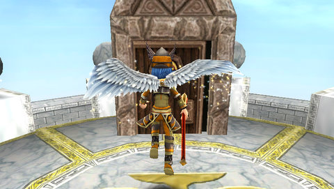
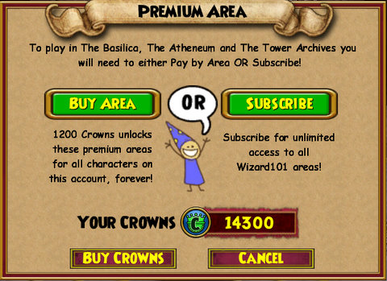
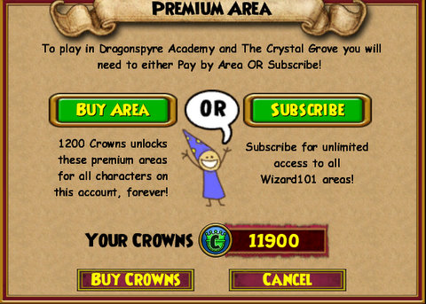
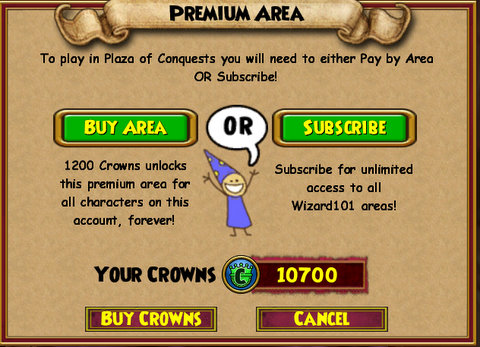

Back to: [West Karana](/posts/westkarana.md) > [2010](/posts/2010/westkarana.md) > [June](./westkarana.md)
# W101: Wizard City on 1200 Crowns a Day

*Posted by Tipa on 2010-06-16 23:39:12*

Amazon.com panicked; they'd let me download the "Symphonic" Les Mis soundtrack before they tried to charge my debit card. The debit card, it was dead. Bank of America, fearing a leak of card information, had revoked their debit cards and sent new ones out; mine was in an envelope on my desk. But unless I informed Amazon and every other outfit which had my debit card information about the new number, all my recurring subscriptions and everything else would, as they tried and, like Amazon, failed to remove money from my account, remove me from their rolls.

I watched all my MMO subscriptions come to an end in their times. EVE Online. EverQuest and EverQuest 2. Wizard101. World of Warcraft should be up soon. Star Trek Online, I have for a year, so that's in no danger.

Friends wanted to play Wizard101, though, and I'll play anything if I can play with friends. I decided to keep the subscription for my main character. Since KingsIsle had downgraded my second account to "Trial" when their charge was denied, I thought I might see how Wizard101 was when you had to pay for each new zone.

It's a pretty sweet deal when you think about it. Once you buy a zone, it's yours. No subscription fees, any other character on that account can use it without further charge. I bought $25 worth of Crowns from the online shop; that's about $2.18 per zone. My friend Mike and I did some Marleybone quests; $2.18 every time I ported to him. He moved on to Mooshu, and it was $2.18 for every new instance or adventure zone. Amber Stargem asked if I'd be interested in a Kensington run; I love Kensington! It cost me $2.18.

Unfortunately, Amber got accidentally locked out, and a fire wizard, Kyle FireSword, and I had to finish it ourselves, without any ports to each other lest we get locked out as well. Didn't even get any pets from it.

The problem with buying zones *à la carte* is that after, you're locked in. If you change your mind and decide to subscribe once again, you've wasted all that money spent unlocking zones one at a time. The only possible way to protect your investment is to keep buying zones at $2.18 each.

How do these economics work out?

I blazed through my initial $25 investment in one night of grouping. That would pay for almost three months of subscription time. When I returned to Dragonspyre to finish up some quests there, I had to spend another $25 for crowns to unlock that world. Two days of play cost me $50 -- five months of subscription time, which would certainly have taken me through this summer's new world of Celestia. As it stands now, I will have to pay, I imagine, another $25 as I travel through the new world. Sure, I won't have to pay to unlock them *again*. I'll have spent enough for a discounted year's subscription at that point, though.

That's assuming nobody invites me to group in Grizzleheim, Krokotopia or the non-free portions of Wizard City (I can guess Briskbreeze Tower will cost me another $2.18).

I've been recommending potential Wizard101 players try out the "pay as you go" plan if the thought of another game subscription is what's keeping them away. After taking my own advice, I'm going to have to back away from that recommendation. The numbers don't add up -- the "pay as you go" plan will end up costing you far, far more in the end than a subscription. The linear nature of the game will give you little reason to return to those unlocked zones, unless you have friends asking you back, or level more than one character through the game.

Even so, you're better off subscribing. You'll find plenty of other ways to spend those Crowns.

