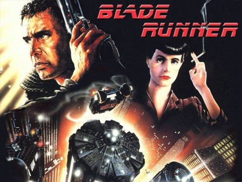
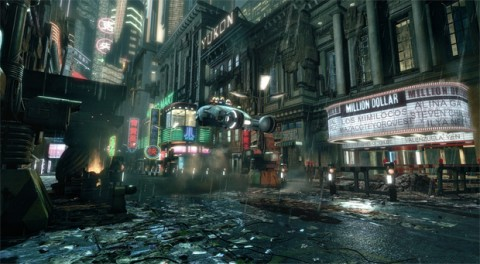

Back to: [West Karana](/posts/westkarana.md) > [2010](/posts/2010/westkarana.md) > [May](./westkarana.md)
# IPs that should be MMOs, part 2: Blade Runner

*Posted by Tipa on 2010-05-06 06:32:57*

Exhausted by centuries of abuse and war, Earth is a dying planet. The best and brightest have fled to neighboring solar systems for a second chance at life. Most of the world's wildlife is extinct, and people treasure those animals that survive, like an accidental toad, or a sheep placidly grazing on a rooftop garden. Despair is avoided through the omnipresent mood organs. Humanity pays for its many sins by sharing the suffering of a post-apocalyptic messiah, William Mercer, as he struggles to stay alive in his own little Hell. Artificial snakes, camels, ostriches etc -- replicants -- were developed to fill the human need to share their world with other life. Now, human replicants, engineered as a slave race for offworld colonists, have returned to Earth to build a new life for themselves on a world their masters have ruined.

[Blade Runner](http://en.wikipedia.org/wiki/Blade_Runner), based on Philip K. Dick's "[Do Androids Dream of Electric Sheep?](http://en.wikipedia.org/wiki/Do_Androids_Dream_of_Electric_Sheep%3F)", continues and modernizes the visual vocabulary of a post-apocalyptic dystopia first seen in Fritz Lang's [Metropolis](http://en.wikipedia.org/wiki/Metropolis_(film)). It combines and transcends its inspirations into an alloy that defines its world exactly, and places the viewer in it. At the end of the world, the book and the movie argue in their own ways, we will still be learning what it means to be human.

[caption id="attachment\_5120" align="aligncenter" width="480" caption="Blade Runner rendered in CryEngine 2"][/caption]

I thought yesterday's "Gunsmoke" would be a perfect sandbox game because, well, there's a lot of sand in the setting. Blade Runner would be strongly story-driven through quests and missions. Set years after the movie, replicants have discovered how to build themselves, and are hunting down what remains of humanity to leave the world pure for replicant life.

As in the book and movie, the players would be bounty hunters, protecting the last human cities against replicant attacks as they search out the breeding crèches and root out replicant infiltrators in their own ranks. As the missions progress, players might well discover that they themselves are replicants implanted with false memories of a human life. 

Players would gain experience from completing missions and retiring replicants, have stats that would give them better chances at killing or investigating or infiltrating, but their most important characteristic would be that of empathy.

Kill too much or too indiscriminately and your empathy goes down. Are you a replicant? Care too much and your empathy prevents you from killing anything at all. Can you survive?

It's not that nobody wants to make a Blade Runner MMO -- watch the movie and you can't help be drawn into that world -- it's that the normal MMO tropes make little sense in a setting that places such a high value on learning to care about your fellow man, even if your fellow man turns out to be artificial. Bioware's Star Wars: The Old Republic, with its story-based (and, yes, combat heavy) approach to MMO development, may well open the way for other MMOs to bring fuller, more subtle worlds to players.

Tomorrow in part 3 of IPs that should be MMOs: We take on Frank Herbert's epic ode to ecology, fundamentalism and T. E. Lawrence, Dune.
## Comments!
---
**Sc opique** writes: If I had the Sceptre of Power and was able to create on MMO based on an existing IP, it would be Blade Runner. However, I think there's the potential to tell many more stories in that world outside of the human-replicants. It's what the book/movie were about, but along with Neuromancer and Snow Crash, Blade Runner has become THE template for the "cyberpunk" genre. To create a "cyberpunk" game based solely on a facet -- albiet a popular facet -- of only one of the tentpoles of the genre would make me sad  :(  But also happy  :)
---
**Tipa** writes: Cyberpunk? I dunno.... Never really thought of it that way, though the movie would share some visual vocabulary with Neuromancer.\n\nI feel that expanding the IP beyond fundamental questions of what it means to be human into something more generic -- or to graft hacking and netrunning into the world -- would dilute  what I see as the core of the game. Where dies the player fall on the empathy scale? 
---
**Stabs** writes: I read something on F13 about someone negotiating for this IP. In the end they said that the IP would cost more than the added profit it would bring to the game.\r\n\r\nI can see their point - it's a very loved cult IP for some of us sci fi film nerds but it doesn't have the mass appeal of something like Twilight or Transformers.
---
**Brian 'Psychochild' Green** writes: The other problem you face is that it's a rather dreary setting.  While some people might like to go explore the world, is it really someplace you want to go hang out and have fun with?  Is this the type of setting that you get off work and think, "I can't wait to get into a world where humans have destroyed the environment to the point that we have to have fake animals!"\r\n\r\nDamion Shubert calls this <a href="http://www.zenofdesign.com/2005/02/14/home-sweet-home/" rel="nofollow">the corner bar</a> aspect of games.  You need somewhere not depressing to hang your hat at the end of the day.  There's a reason why WoW is so brightly colored and cheerful in many areas.  Even the "evil" areas are done in bright purples and greens instead of dark blacks and darker blacks.  The world draws you in and makes you want to experience even the more "evil" areas.\r\n\r\n<i>Bladerunner</i> ain't that setting.\r\n\r\nI've mentioned before I'd like to do a cyberpunk game, but it runs into the same problem: it's not a friendly place to live by definition.  People aren't going to take to it very well.  And, as pointed out, if you're forking over big money for a license, then you absolutely need a big hit.
---
**wilhelm2451** writes: I would put Blade Runner more in the "dystopian future" genre as opposed to cyberpunk.  Blade Runner lacks that shared virtual reality aspect that seems to define cyberpunk in works of Gibson and those who followed, and Philip K. Dick seemed to be more about dystopia in his works in any case.\r\n\r\nBut as a setting for a game, Blade Runner has a lot of potential.  Nearly 20 years back there was a game called Spaceship Warlock, one of the first CD-ROM based games, that started off in a city that had a very Blade Runner feel to it, and that helped draw people into the game right away.  I could sell $300 single-speed CD ROM drives to people just to play that game, based on the first few minutes of it.  And the game itself was $99.  And this was 1991.  It could have that kind of power again if done right.
---
**Yogi** writes: Not sure I could get into a Gunsmoke mmo, but Bladerunner and Dune... those would be really exciting.  Although both are getting to the point where the younger generation has no clue what they are.  :(\r\n\r\nGreat series!  Looking forward to tomorrows.
---
**Tipa** writes: I hadn't really thought about that; clearly in the book and in the director's cut of the movie, Earth was a dying planet. The book especially went into detail about the Earth outside of the future LA. But then I think about the ultimately depressing vistas of death seen such games as Call of Duty 4; grays and browns and ruins and death everywhere.\n\nFor MMOs, there's Fallen Earth -- even the name brings to mind death and ruin.\n\nBlade Runner (the movie) was a very colorful, bright and exploration-friendly setting; and even though the back story was grim, people were leading normal lives as much as they could. The movie also glossed over a lot of the back story -- if you weren't paying attention, you might not realize at all that it WAS a post-apocalyptic world. The original theatrical version even implied, at the end, that the world was verdant and whole outside the city.
---
**Brian 'Psychochild' Green** writes: Tipa wrote:\r\n<i>But then I think about the ultimately depressing vistas of death seen such games as Call of Duty 4; grays and browns and ruins and death everywhere.</i>\r\n\r\nYes, but in games like CoD4, you're a hero.  You're fighting the "bad guys" and making the world safe for democracy, capitalism, and apple pie.  Or something like that.  Given our current cultural attitudes, CoD4 is going to be a lot more appealing to people than a dystopian setting.\r\n\r\n<i>For MMOs, there’s Fallen Earth — even the name brings to mind death and ruin.</i>\r\n\r\nYes, but that's a relatively niche game.  There's no such thing as a big-license niche game without someone, somewhere crying into their beer about losing so much money.\r\n\r\n<i>The original theatrical version even implied, at the end, that the world was verdant and whole outside the city.</i>\r\n\r\nYes, but that's not where the excitement is.  It's like having a great newbie experience, but then the game gets bland after Tortage.  I mean, after the starting area.\r\n\r\nNot to be a total downer here.  Just pointing out reasons why people haven't jumped at this setting yet.
---
**/AFK &#8211; Mystery Date Edition &laquo; Bio Break** writes: [...] I choose Door #5! [...]
---
**Vesta** writes: Bladerunner MMO.  Oh yeah, I'd play that!
