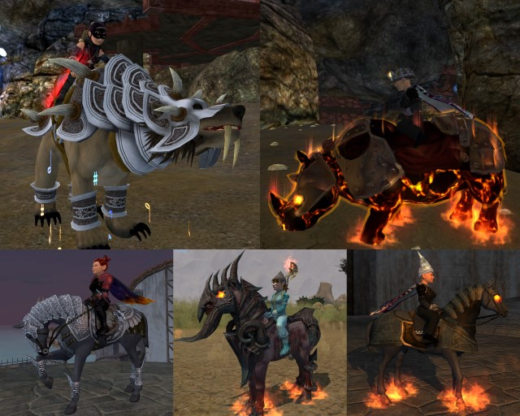

# EQ2: My Mounts, a rant

*Posted by Tipa on 2010-05-21 06:45:52*

It doesn't bug me that SOE is selling mounts. Why not? It's widely reported that the MMO developers feel constrained by the industry standard $14.95/month subscription fee, and are always looking out for new ways to let players send them more money, above and beyond their sub.

Blizzard's sparkle pony and SOE's cash cat provide the opportunity to further support your game of choice. There's nothing wrong with that.

What really bothers me is the "me too"-ism. The original EverQuest was known for innovation. Raiding, monster missions, mercenaries, tribute, configurable UI, hardware graphics acceleration; some elements may be found in other games, but EQ was the total package. When EQ did something, other games would follow. World of Warcraft took the EQ model and leaped ahead, but nobody forgets the game that spawned it.

EverQuest 2 started out charting its own path, with the archetype/class/sub-class progression, raids from level 15 up so you would not have to wait 60 levels for the "good stuff", traps that needed disarming, solo and group-oriented heroic opportunities, player housing, mentoring so that people of any level could play together, a character creator that, at that time, was almost unprecedented in customization (City of Heroes being the obvious winner there -- by a hair).

Now, it really seems like EQ2 is taking its cues from Blizzard's lead. The spell and ability names, once unique and very much looking back toward its D&D roots, are now just generic and numbered. Fireball I, IV, IX.... Transportation is being simplified so that one click can bring you anywhere in the world -- there'll be no need to explore a zone any more. Now the copy cat.... I dunno. I imagine that soon EQ2 will implement the WoW quest tracker that points you toward your quests, and then the transformation will be complete.

Fact is, EQ2 players DON'T WANT to play WoW. But the more the distance between the games closes, the more people will just go with WoW because, well, they are the innovators of the day.

