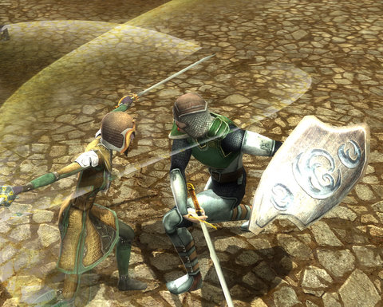
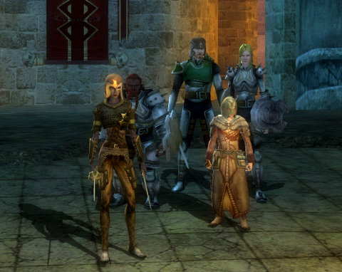

Back to: [West Karana](/posts/westkarana.md) > [2010](/posts/2010/westkarana.md) > [October](./westkarana.md)
# DDO Weekly Recap: Tangleroot Gorge

*Posted by Tipa on 2010-10-11 06:44:58*

Whatever else you say about the game, one thing you have to admit -- Dungeons & Dragons Online has some really cool armor looks. My old [Hobbesian Cleric](../../../index.php/2010/01/08/dungeons-dragons-online-a-hobbesian-cleric/) eventually wore armor that really let out her inner [half-orc](http://www.massively.com/2010/09/03/ddo-update-7-bringing-half-elves-half-orcs-and-more/). My drow rogue, Ophiga, got a nice set of +3 chain that is really amazing. EQ2 really missed the boat on armor -- they started out with some really unique designs, but ended up with variations on textures.

I'd owned the Tangleroot Gorge module from my time with Massively's OneDAwesome guild. so when [Gleek](http://thefriendlynecromancer.blogspot.com/) suggested that as a possible destination, I was excited to return to that really long quest chain with the Sunday crew. Unfortunately, being paid content, I ended up the only one who could actually go. I remembered that Rubi had had the ability to give out guest passes, good for 90 minutes or three hours, to folks. I offered to buy guest passes for everyone, and we set off.

Since I only had a dim recollection of the module, we wasted a lot of time exploring the gorge, looking for the Chieftain, when it turns out an NPC in the One-Eared Bugbear Tavern will teleport you there for the asking. After Gleek (sorceror) had shown his true halfling colors by pushing Goddamn Spode (paladin) off a broken bridge, we eventually did find the Chieftain, and started working our way through his dungeon, one quest at a time.

That unkillable spider? Really unkillable. We gave it our best shot.

Due to all the delays and unintended exploration and just being lost a lot of the time, we ended the night with just twenty minutes left on the guest passes, and a promise to waste no time getting started the next Sunday, last night.

Fast forward a week, everyone but Ulan (favored soul) was on. With the clock ticking, we decided to try and see if we could finish Tangleroot Gorge's main questline in twenty minutes. First up was a combination lock puzzle that required dialing in four runes on four dials scattered through some corridors, all guarded, of course. Good thing the combination was displayed in gnome-high glowing runes right at the magical barrier we needed to drop. Way to show you care about security, Orc dudes. They'd locked themselves in. Nice.

We dropped the barrier and a named shaman. The timer had run out but Gleek and Spode were still in the instance; were we safe as long as nobody left the module? We recalled to the Chieftain and turned in the quest, got the final one and tried to return -- but nope. Couldn't get back in. I bought new passes for the wonder twins and we re-entered to finish the job.

Each time we went through the instance, we'd see signs of our previous passing. Locked doors would be opened. Levers would be thrown. Portcullises would be raised. But even though the residents had had no time to close and lock doors and so on, they would have plenty of time to replace all the crates, barrels and vases we cheerfully destroyed every time we passed them. It's wonderful to see the dungeon denizens have their priorities straight.

We got the keys to attack the big bad guy from two littler bad guys (Krug and Urguz or something). Krug and his friend (I only remember Krug's name because Spode was singing it) each had some sort of instant kill ability. Krug got me, his friend got Gleek. Spode had died earlier (and miraculously come to life), so we each had a death for the night. I don't remember HOW Spode died. I'm sure it was epic. He always has the best deaths. A couple weeks ago, it was the drowning.

We gather to take on the boss of the whole dungeon. I thought I remembered there being some sort of trick to the room -- with its three steep stairways -- but that came to naught. We crept up one of the side stairs but nonetheless aggroed the room. We killed the adds and then the boss and that was it.

There were secret doors on either side of the room, leading to traps and treasure. My Spot skill hadn't alerted me to either of the traps, or in fact to any of the traps the whole night. How useless is that? Oh, NOW I remember how Spode died. He detected a fire trap for me. After that, I was asked to scout ahead :)

With the adventure over, Ulan logged in -- we'd all forgotten about Canadian Thanksgiving. He and Gleek returned to the Gorge to finish out some slayer achievements, while Spode and I went to the Marketplace to spend some skill points (in my case) and level (in his).

Next week, Ulan is on the hook for guest passes for Three Barrel Cove. I'm so close to level 6 that I'll probably run a quest chain (perhaps Catacombs) for the level before next Sunday.This might be the time to take a level in ranger or bard... but I feel icky about leaving The Path. Departing from the guided path in DDO just had me swimming in mediocrity with the Hobbesian Cleric; but, I think having some bardic abilities would be fun. Probably not optimal, but who cares? I've never been a min-maxer.

