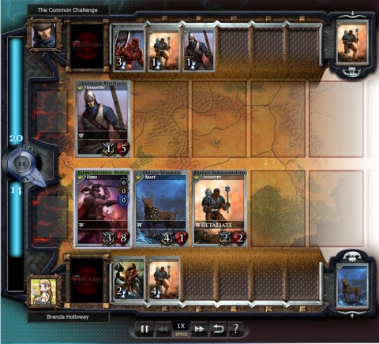

Back to: [West Karana](/posts/westkarana.md) > [2010](/posts/2010/westkarana.md) > [September](./westkarana.md)
# Facebook game roundup: Warstorm and City of Wonder

*Posted by Tipa on 2010-09-14 07:03:37*

If you've ever played the Pokemon, Yu-Gi-Oh or Magic: the Gathering card games, you're already pretty familiar with the game behind Zynga's [Warstorm](http://www.facebook.com/Warstorm): collectible card battle games where you build a deck and then draw monsters from it with which to attack your opponent's health. First to lose all their health (called 'morale' in this game) or run out of cards, wins.

You obtain cards in the now-familiar metaphor of the booster pack, bought for in-game silver or real world cash. Each card -- all of which are beautifully illustrated -- represents a unit. Units have a draw time -- the number of turns a card must wait after it is drawn before it can be played. This can be as much as ten turns for the most powerful cards, or as little as one for cheap, expendable infantry. Cards also have an attack power, health, and an optional special ability.

Units are formed into six-unit squads based around hero cards, which you occasionally win but may be bought. Hero cards typically have high health, attack, and draw time and may have some decent special abilities as well. Both heroes and regular units have a faction -- human, elven, orc and so on -- with their own thematic design and powers.

As each drawn card comes into play, it is placed against you opponent's card. Each card attacks the card directly across from it (unless its special ability says otherwise). If there is no card across from it, the card attacks its opponent's health directly. When a card's health drops to zero, it is removed and all the cards to its right are shifted over.

As you play through the single player campaign, you will conquer more of the land around your starting territory. The more land you control, the more silver you gain each day from taxes. You may also take part in daily battles and can battle against your friends.

Warstorm is pretty non-spammy for a Facebook game, doesn't require a boatload of friends, and is an interesting take on the collectible card battle game genre. Definitely recommended.

Playdom's [City of Wonder](http://www.facebook.com/CityOfWonderGame) is a workmanlike addition to the city building genre. In City of Wonder, you start as the ruler of a small collection of primitive huts, and through trade, culture and war, expand and improve your territory until you are master of a vast land of skyscrapers and high speed railways.

Similar to Playfish's [My Empire](http://www.facebook.com/myempiregame), you can draft friends to help you build structures of surpassing powers -- the Colossus of Rhodes, the Great Wall and so on. These 'wonders' are vital to your success as a nation -- because in City of Wonder, dominance is the path to victory.

You build your nation along three tracks, which unlock their own various structures and improvements -- trade, which earns you money; culture, which nets you experience; and war, which nets you population (from captured slaves, natch). Every structure enhances one or more of these attributes, and when you go out into the world to explore your ever-shifting neighbor nations, you can choose to meet them for cultural exchanges, trade missions or battle. Dominance in any of these is a win for your side and is counted as a loss for the other. Your three advisors (one for each attribute) will give you a vague idea of how likely you are to win a trade, cultural or war battle.

If you win a war battle, some war structures in your opponent's city are set burning, and your name is floating above it, right next to the "do you wish to retaliate?" icon. So if you defeat another nation in battle and take some of their population back to work in your slave mills, expect them to come calling.

By luring friends into the game, you can place embassies in each other's nations, which can give you an increasing amount of silver each day. You will need friends, and lots of them, to get the most out of City of Wonder. Certain structures can only be built with the aid of lots of friends; expanding your nation takes friends; the rewards you get from successful battles depend on the friends you have. Of course, if you haven't many friends who play, you can spend money to fast track the process.

You can win, or friends can give you, legendary heroes. These are names from history, such as Pericles or Napoleon, who can be played to give you advantages or short term buffs. If you've just been on a rampage and have set fire to a dozen nations, you might want to play the card that gives you a substantial defense buff to help fend off the inevitable retaliations, for instance. Other legendary heroes can help research faster, hurry the production of goods and so on.

Where My Empire was a "play five minutes per day" kind of game, City of Wonder can keep you clicking for hours at a time. The game isn't all that spammy (it's up to you), but you will need at least fifteen friends playing to get the most from the game. It shares the drawback of most social games of this type in that there is no real way to win or lose. You will just keep playing.

