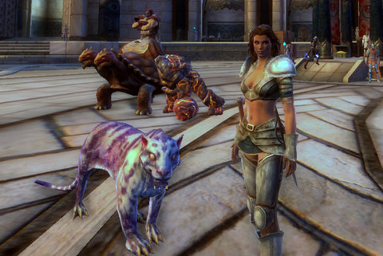

# Is social networking killing the MMO genre?

*Posted by Tipa on 2011-08-17 06:54:36*

[caption id="attachment\_6472" align="aligncenter" width="480" caption="Not social enough for Rift?"][/caption]

Rift was my main game this year, the one I would play before any other. The only real way, I feel, to really enjoy a MMO is to go all-in, completely devote yourself to it. Otherwise you remain an outsider or a dabbler. I love MMOs, so if I followed my natural inclination, I'd just play a dozen at a time but never really get to know any of them.

But Rift was the real deal, a fantastic effort from a great group of people who did an imaginative variation on the tried-and-true World of Warcraft gameplay. I devoured the game, got through all the T1 and T2 dungeons, finished my T1 armor set and was busy replacing it with T2, had done the first couple ranks of PvP and had maxed out all three crafting professions. I'd even started a little raiding, as well as having fun in the pickup rift raids.

Then I stopped playing. I didn't have any explanation. Work got busy again, but that wasn't it. My guild started emphasizing raiding more, but that wasn't it -- raiding isn't required in the guild. I had fulfilled all my goals in the game, having seen all the non-raid content by then. That was part of it.

What was I doing besides playing Rift? I wasn't playing another MMO. I wasn't even playing many single player games. Mostly I was chatting with friends on Twitter, Facebook, blogs and recently, Google+. Google+ in particular has become a fantastic platform for serious discussions; blows Twitter away.

Turns out what I really love about gaming is the social interaction; clear back through EverQuest, it was the chance to hang out with like-minded friends that kept me logging in. And with social networks, I can hang out with like-minded friends no matter what I do.

I first noticed this phenomenon back when Dragon Age: Origins came out. It's a single player game, but a lot of the people in my circle were playing it and we used Twitter and blogs to keep each other up to date on our progress and to discuss the game. It was a fantastic experience, and I awaited each expansion and DLC so I could play alone (with friends) again.

The same thing happens with books -- when George R. R. Martin came out with his fifth book in the Song of Ice and Fire series, Dance With Dragons, we read it together and my longest Google+ discussion remains that with friends who have also read the book.

This whole social media revolution has changed gaming.

Friends met through a MMO would often essentially vanish when they stopped playing. Now, these friends move up a level, and you can opt to keep gaming together. MMOs used to be entirely about community building. Now that better tools are available, MMOs are less about community and more about being quick fun. Which kind of diminishes the entire raison d'etre of MMOs to begin with.

I'm looking forward to Skyrim and Diablo 3. I'm sure they'll be great games in their own right, but I know I'll be able to share the experience with dozens of other people playing the same time, and \_that's\_ going to make all the difference.

