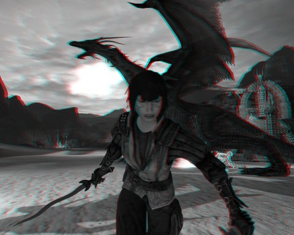

# Dragon Age 2: Money shot

*Posted by Tipa on 2011-04-02 13:52:36*

[caption id="attachment\_6318" align="aligncenter" width="480" caption="Just get 3D glasses already"][/caption]

All I hear is people complaining about Dragon Age 2. It's linear. It isn't as good as Dragon Age: Origins. Blah blah blah. But you know what's different -- and better -- about Dragon Age 2 vs Dragon Age: Origins or Dragon Age: Awakenings?

In DA2, you have to decide where you stand on certain fictional issues. In DA:O, the Templar/Chantry/Mage trinity was set up in its most ideal way as the three pillars of a supernatural triangle, each checking the power of the others.

In DA2, though, the mages have gone insane. Almost any time a mage is involved, they are involved in the worst possible way, taking any situation and making it hellworthy. It would be easy to just draw a line in the sand and say no more, mages must be dealt with. Many will ask you to do exactly that.

But your sister is a mage. YOU may be a mage. And the only healer I have come across is not only a mage, but an insane murderer who is possessed by a demon. You're forced to admit that, while essentially making a deal with demons is BAD and all, you sure could use a heal right about now.

You're not going to win with your companions all the time, either. All of them tend towards a particular point on the Templar/Chantry/Mage triangle, and will resent your efforts to stay neutral (or much worse, take sides).

Thing is, all your NPCs are MISSING THE POINT. But don't think that lets you off the hook.

I like Dragon Age 2 because it defines several sets of values and forces you to look past how smart, endearing, cute or funny someone is to what their values are, and if they gibe with yours.

Also, dragons. Dragons dragons dragons I love killing dragons.

I have lost against the High Dragon above twice... but I think I have come up with a new strat.

